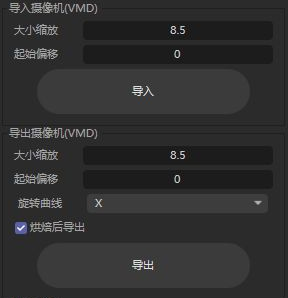
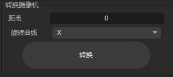
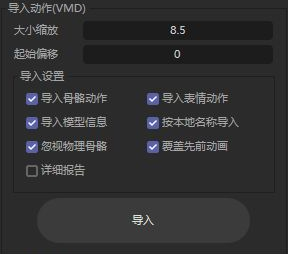
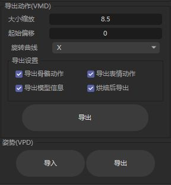
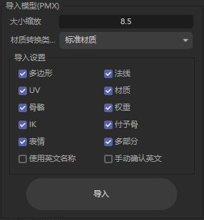
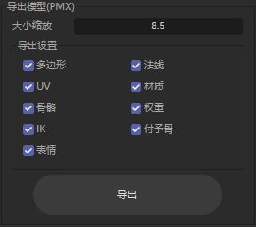

# C4D MMD Tool

     

  

## 关于

Cinema 4D的mmdtool。

用C ++编写的Cinema 4D插件，用于将MikuMikuDance数据导入Cinema 4D。

## 发行版

插件点击  下的最新版本下载

发行文件名包含插件版本、适用的 Cinema 4D 版本和平台：

- **Windows x64**：`MMD-Tool-v<版本>-Windows-x64-Setup.exe`，一个安装包覆盖 Cinema 4D R20 至 2026，在安装向导中选择版本。
- **macOS Intel**：例如 `MMD-Tool-v<版本>-Cinema4D-2026-macOS-x86_64.zip`，按 Cinema 4D 版本选择 ZIP。旧版配对标为 `R21-S22`、`R23-S24`、`R25-S26`，R20 单独提供。当前发布的 macOS ZIP 为 Intel 构建，Apple Silicon 构建仅在 CI 中验证。

目前，主要维护版本为R20及更高版本，R19及以下版本未提供支持。

## 使用方法

1. 选择相应的插件版本，并将其放置在Cinema 4D安装目录下的plugins文件夹中。
2. 运行Cinema 4D，在菜单->扩展（插件）栏中找到 `MMDTool`，然后单击运行。

### 界面与功能展示

以下截图于 2026-10-06 在 Cinema 4D 2026.4.0 中实机截取，展示当前工作树插件的中文界面。截图仅保留对应的功能区域。各页可上下滚动；已发布版本的界面可能有所不同。

#### 摄像机 · VMD 导入、导出与转换

| 导入与导出 | 摄像机转换 |
| --- | --- |
|  |  |

- **导入摄像机**：从 VMD 文件导入摄像机动画，可设置大小缩放和起始偏移。
- **导出摄像机**：将摄像机动画保存为 VMD，可设置大小缩放、起始偏移、旋转曲线与烘焙后导出。
- **转换摄像机**：将普通摄像机转换为 MMD 摄像机，可设置距离和旋转曲线。

#### 动作与姿势 · VMD / VPD

| 动作导入 | 动作导出与姿势 |
| --- | --- |
|  |  |

- **导入动作**：向模型导入 VMD 骨骼动作、表情动作和模型信息，可设置大小缩放与起始偏移。
- **导入选项**：按本地名称导入、忽视物理骨骼、覆盖先前动画，以及显示详细报告。模型信息包含 IK 开关和模型显示状态。
- **导出动作**：将模型的骨骼动作、表情动作和模型信息保存为 VMD，支持旋转曲线设置与烘焙后导出。
- **姿势**：导入 VPD 姿势，或将选中 MMD 模型当前时间点的姿势导出为 VPD。

#### 模型 · PMX 导入与导出

| 模型导入 | 模型导出 |
| --- | --- |
|  |  |

- **导入模型**：设置大小缩放，选择多边形、法线、UV、材质、骨骼、权重、IK、付予骨和表情等数据。
- **材质转换类型**：可选择标准材质、RedShift、Octane 或 Corona；使用相应渲染器时需具备对应环境。
- **导入选项**：支持多部分网格、使用英文名称和手动确认英文名称。
- **导出模型**：将选中的 MMD 模型保存为 PMX，可设置大小缩放并选择导出的数据。导出对象需为插件管理的 MMD 模型。

飞书文档: https://fsrjo99ngu.feishu.cn/docs/doccnjnPb8YuNmiVEheSzBj7bSd

## 开发者说明

**开发文档：** [DEVELOPMENT_zh.md](DEVELOPMENT_zh.md) · [English DEVELOPMENT.md](DEVELOPMENT.md)

**MCP 接入：** [客户端配置](docs/dev/mcp-client.md) · [实现与验收状态](docs/dev/mcp-support.md) · [2026-10-08 验收](docs/dev/mcp-acceptance-20261008.md)。当前工作树的 16 个生产工具与适配器已完成 Windows / C4D 2026.4+ 验收，包含普通 Release/桥 OFF 的真实调用、超时恢复与宿主重启。macOS 和旧宿主 UI 已明确延期并保留未验证；公开发行尚未验收。

### 开发者：CMake 构建（多 SDK）

- **基线**：日常使用根目录 `dev-windows` / `workflow-dev` 预设；直接构建 SDK 时使用各 `sdk_*` 中的预设。2026 SDK 工具链位于 `sdk_2026/cmake`；兼容 SDK 桥接使用 `cmake/sdk`。
- **依赖**：Bullet3 与 libMMD 通过 `cmake/mmdtool_plugin_dependencies.cmake`（`mmdtool_plugin_dependencies_add`）以 **CMake 子目录 + 目标链接** 并入各 `sdk_*` 工程，**无需**安装到 `dependency/install`。可选根工程：`cmake --preset dev-windows` 后 `cmake --build --preset cmt-deps-build`。libMMD 测试：预设 `dev-windows-deps-test` + `cmake --build --preset cmt-deps-test`，或 `-D CMT_DEPS_ENABLE_LIBMMD_TESTS=ON`。清理：`cmake --build _build_msvc --target cmt-clean-deps`（需已配置根工程；会删除各 `sdk_*` 在 `_build_msvc/<sdk名>/cmt_deps` 下的 Bullet/libMMD 构建树，以及根工程 `dependency/` 子项目产生的 `_build_msvc/cmt_deps`）。若要连插件目标一并清空，可用根目标的 `cmt-clean`。
- **仅生成某 SDK 的工程文件（Windows）**：`configure_sdk.bat sdk_2026 windows_vs2022_v143`（preset 可省略，默认 `windows_vs2022_v143`）。
- **根目录预设 `dev-windows`**：只生成仓库**根**工程 `_build_msvc`（含 `dependency/`、`cmt-workflow` 等），**不包含** `mmdtool` 目标。查看/调试插件请在仓库根下的 **`_build_msvc/<sdk名>/`**（在 `sdk_*` 里执行 preset 时同样输出到此路径）打开解决方案，或先执行 `cmake --build --preset workflow-dev` 生成该目录。
- **根目录一键工作流**（需先配置根工程一次）：
  1. `cmake -S . -B _build_msvc -G "Visual Studio 17 2022" -A x64`
  2. `cmake --build _build_msvc --target cmt-workflow`（依赖 + 配置 + 编译插件；可通过 `-D CMT_SDK_DIR=...` 等变量指向目标 `sdk_*`）
- **典型命令**（仅插件、在某一 `sdk_*` 内；构建树在**仓库根** `_build_msvc/<sdk名>/`）：
  1. `cd sdk_2026`（或目标 `sdk_r25`、`sdk_2024` 等）
  2. `cmake --preset windows_vs2022_v143`
  3. `cmake --build ..\_build_msvc\sdk_2026 --config Debug`（将 `sdk_2026` 换成当前目录名）
- **产物**：Debug 下插件一般在 `_build_msvc/sdk_2026/bin/Debug/plugins/mmdtool/`（相对仓库根；SDK 目录名随版本变化）。
- **Release 与测试**：`cmake --preset release-windows` 后 `cmake --build --preset workflow-release`；测试用 `dev-windows-deps-test` 配置后运行 `cmt-deps-test`、`cmt-plugin-tests`，benchmark 使用独立的 `cmt-deps-benchmark`。PR/main CI 跑功能测试及最新 SDK 编译，发布跑完整 SDK 矩阵。
- **运行资源**：产物中的 `res/` 是经过校验的真实副本，资源单独修改也会刷新。`CMT_RUNTIME_RESOURCE_CONFIG_POLICY=reset` 默认使用仓库配置；本地 `preserve` 可保留输出目录中的偏好。调试时正常启动 C4D，插件加载后再 attach，详见开发文档。
- **Windows 安装包（Inno）**：`cmake --preset package-windows` 后 `cmake --build --preset inno-installer`，自动构建八套 SDK 再出包。`setup/Common/installer_script.iss` 消费 `_build_msvc/<sdk>/bin/Release/plugins/mmdtool/` 中的二进制与完整 `res/`。S22/S24/S26 组件分别复用 sdk_r21 / sdk_r23 / sdk_r25 产物；自定义路径可传 `/DSdkBuildDir=...`、`/DSdkBinConfig=...`。

若模型导入时勾选多部分出现问题请不要勾选。

**如果安装了插件没有显示，请检查是否C4D安装的为最新小版本（如R21的是R21.207才行，R21.115不显示的升级就可以用）**

## 版本更新

这里保留最近三个发行版本；更早版本及中间构建标签见[完整更新日志](CHANGELOG_zh.md)。

### 0.9.2.2 · 架构、表情与材质更新（2026-10-08）

相对 `v0.9.1.20` 的改动，按模块整理：

1. **模型运行时与骨骼：** 将 IK/物理重建、每帧求值、表情求值和材质转换拆入独立模块；明确 EDIT / ANIM 绑定姿态切换，统一保存重开、复制和动画槽变更后的运行时重建。同步骨骼层级与索引变更，缓存分层执行计划，并恢复保存的骨骼显示设置。
2. **动作与摄像机：** 完善 VMD 追加、替换、合并和频道选项，按动画槽保存表情、IK 开关和模型显示状态。改进烘焙导出、缩放转换与源场景状态恢复；修正相机垂直视场角和单位换算，迁移旧轨道，修复导出成功提示和临时对象清理。
3. **表情与持久化：** 单独分类 UV/Additional UV 表情并保留 PMX 偏移；保存冲量表情 offset 和表情面板。统一组合/翻转表情展开与混合预览；修复失效网格标签引用及运行时缓存序列化，使撤销/重做后立即保存重开能够安全重建。
4. **材质表情：** 增加带版本的 Standard Shader 和固定 Redshift 节点绑定；分开保存纹理乘/加 RGBA 系数，在采样后运算，并区分 factor Alpha 与图片透明度。增加混合预览、重置、支持诊断、显式升级/修复和独立材质副本，完善事务撤销/重做及所有权检查。
5. **Standard 与 Redshift 材质：** 新增基于原生 Toon/Contour 的 MMD 风格 RS Toon 转换，覆盖主贴图透明度、Toon 回退、风格化高光、轮廓线和 Sphere Multiply/Add。改进 Standard 球面贴图及普通 RS 高光颜色/Power 换算和反向同步；保留用户连接及采样器颜色空间设置。
6. **PMX 导出：** 统一长度字段缩放，修正 PMX 2.0/2.1 的 softbody 序列化边界；完善写入失败清理和源场景状态保护。
7. **生产 MCP：** 提供 16 个有类型工具和 stdio 适配器，覆盖检查、PMX/VMD 导入导出、动画槽、模式、物理、表情和帧求值，并支持 `redshift_toon` 导入。宿主接入要求 Cinema 4D 2026.4 或更高版本；Windows 验收覆盖真实操作、超时恢复和宿主重启，见[验收记录](docs/dev/mcp-acceptance-20261008.md)。
8. **构建、打包与文档：** 多 SDK 共用源码、资源和 CMake 层，明确 Debug/Release/测试预设，产物携带真实资源副本。Windows x64 安装包覆盖 R20–2026，macOS Intel 按适用 C4D 版本分别提供 ZIP；产物名称包含平台、架构和版本。补充回归工具、开发说明与功能截图。

**兼容与限制：** RS Toon 需要相应 Redshift 原生节点，不支持时会报告原因。材质表情 v1 绑定需显式升级到 v2，旧 Toon 图配方需显式重新转换。Toon 光照/高光和部分轮廓线仍为近似，尚未证明与 MMD 原生图像等价。macOS/旧宿主运行时和完整真实模型物理重放仍未验证。公开 macOS 资产为 Intel 构建，Apple Silicon 构建仅用于 CI 验证。

### 0.9.1.20（2026-07-15）

1. 新增 PMX 材质表情的导入、编辑、保存与导出，覆盖材质字段、纹理系数及 Standard 材质预览。
2. 新增 VPD 姿势导入/导出控件，支持导出当前姿势。
3. 修复 VMD 表情重复求值导致的变形累积，稳定 PMX 骨骼的 EDIT / ANIM 模式切换。
4. 改进 macOS 构建，Windows CI 固定使用 VS 2022；macOS 发行包使用 Intel 构建，另行增加 Apple Silicon 编译验证。
5. 同步各 SDK 的发行资源布局，补齐 SDK 2025 缺失的材质表情资源。

[发行页](https://github.com/AiMiDi/C4D_MMD_Tool/releases/tag/v0.9.1.20) · [相对 0.9.1.15 的变更](https://github.com/AiMiDi/C4D_MMD_Tool/compare/v0.9.1.15...v0.9.1.20)

### 0.9.1.15 · 预发布（2026-05-23）

1. 新增插件管理模型的 PMX 导出，可选择网格、法线、UV、材质、骨骼、权重、IK、继承和表情数据。
2. 新增 MMD 骨骼控制对象，用于调整导入模型的姿势。
3. 恢复旧 SDK 的 PMX 导出编译，修正骨骼索引和 SDK 接口的 Clang 兼容问题。
4. 修复依赖及子模块检出，固定到线上可获取的 Bullet/libMMD 依赖版本。
5. macOS 发行产物统一为 Intel x86_64，并相应限制 Xcode 构建架构。

[发行页](https://github.com/AiMiDi/C4D_MMD_Tool/releases/tag/v0.9.1.15) · [相对 0.9.1.3 的变更](https://github.com/AiMiDi/C4D_MMD_Tool/compare/v0.9.1.3...v0.9.1.15)

## 作者

AiMiDi

   

讨论群：790973593
