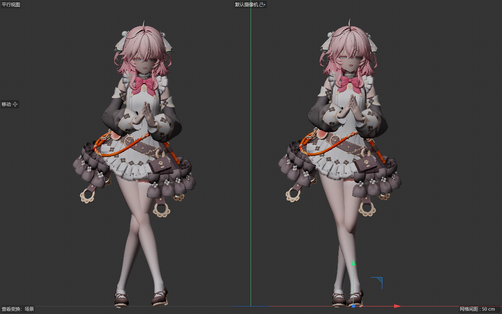
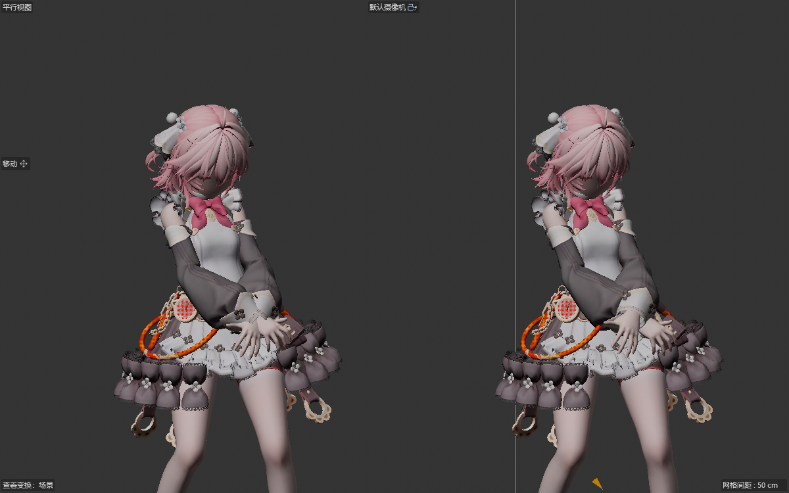

# C4D MMD Tool

     

  

## 关于

Cinema 4D的mmdtool。

用C ++编写的Cinema 4D插件，用于将MikuMikuDance数据导入Cinema 4D。

## 发行版

插件点击  下的最新版本下载

发行文件名包含插件版本、适用的 Cinema 4D 版本和平台：

- **Windows x64**：`MMD-Tool-v<版本>-Windows-x64-Setup.exe`，一个安装包覆盖 Cinema 4D R20 至 2026，在安装向导中选择版本。
- **macOS Intel**：例如 `MMD-Tool-v<版本>-Cinema4D-2026-macOS-x86_64.zip`，按 Cinema 4D 版本选择 ZIP。旧版配对标为 `R21-S22`、`R23-S24`、`R25-S26`，R20 单独提供。当前发布的 macOS ZIP 为 Intel 构建，Apple Silicon 构建仅在 CI 中验证。

目前，主要维护版本为R20及更高版本，R19及以下版本未提供支持。

## 使用方法

1. 选择相应的插件版本，并将其放置在Cinema 4D安装目录下的plugins文件夹中。
2. 运行Cinema 4D，在菜单->扩展（插件）栏中找到 `MMDTool`，然后单击运行。

### 界面与功能展示

以下截图于 2026-10-06 在 Cinema 4D 2026.4.0 中实机截取，展示当前工作树插件的中文界面。截图仅保留对应的功能区域。各页可上下滚动；已发布版本的界面可能有所不同。

#### 摄像机 · VMD 导入、导出与转换

| 导入与导出 | 摄像机转换 |
| --- | --- |
|  |  |

- **导入摄像机**：从 VMD 文件导入摄像机动画，可设置大小缩放和起始偏移。
- **导出摄像机**：将摄像机动画保存为 VMD，可设置大小缩放、起始偏移、旋转曲线与烘焙后导出。
- **转换摄像机**：将普通摄像机转换为 MMD 摄像机，可设置距离和旋转曲线。

#### 动作与姿势 · VMD / VPD

| 动作导入 | 动作导出与姿势 |
| --- | --- |
|  |  |

- **导入动作**：向模型导入 VMD 骨骼动作、表情动作和模型信息，可设置大小缩放与起始偏移。
- **导入选项**：按本地名称导入、忽视物理骨骼、覆盖先前动画，以及显示详细报告。模型信息包含 IK 开关和模型显示状态。
- **导出动作**：将模型的骨骼动作、表情动作和模型信息保存为 VMD，支持旋转曲线设置与烘焙后导出。
- **姿势**：导入 VPD 姿势，或将选中 MMD 模型当前时间点的姿势导出为 VPD。

#### VMD 动作适配 · 体型调整与分阶段对比

把为一个角色制作的 VMD 调整到另一个角色：按来源与目标 PMX 的骨架比例修正移动，按需启用姿态、扭转、手臂避让、手腕／手指接触、落地和腿部自碰撞避让。支持角色队列与相机适配，计算核心位于 [libMMD](https://github.com/AiMiDi/libMMD) 的 `libmmd::sizing`，不依赖 C4D SDK 或 Python 运行时。

1. 在“扩展”菜单找到 **MMD Tools - VMD 动作适配**。
2. 选择动作原本使用的**来源 PMX**，将已经导入场景的**目标 MMD 模型管理器**拖入模型框。
3. 选择 VMD 文件，或使用目标模型已有的 VMD 动画槽。模型与动作导入须使用相同倍率，例如示例均为 **8.5**。
4. 先检查比例／偏移结果，再按需开启高级约束。“手腕／手指接触”保留来源动作中相近手部标志点的相对关系，不会自动生成抓握或手指弯曲；“腿部自碰撞避让”有限度地移动足 IK 目标。
5. 点击计算，查看 C4D 状态栏进度；长计算可取消。通过阶段选择和时间轴回放原始、比例、偏移、姿态、扭转、避让与接触结果，支持并排／叠加对比和修改参数后自动刷新。
6. 检查残差与关键动作后，**应用为新动画槽**或导出 VMD。原动作槽保留。

模型为阿芙 2.0，动作为 Stay Tonight Heaven Lee Ver.。以下为 C4D 原生视口效果，物理关闭。

**腿部与整体姿态：左侧直接播放未经适配的原始 VMD，右侧为完整动作适配结果。** 两侧使用相同导入倍率、动作帧和视角。

**手腕接触修正：左侧为旧接触求解结果，右侧为保留手部姿态后的修正结果。** 此图展示交叠手部的处理变化。

**当前范围：** 避让基于标准骨链与刚体形状，不保证网格级无穿插，也不替代完整物理模拟或足底锁定。深度交叉和互相冲突的目标仍可能需要手工调整，请结合分阶段预览检查关键姿势。

**参考项目：** 体型与移动补偿参考 [miu200521358/vmd_sizing](https://github.com/miu200521358/vmd_sizing)，依据版本 `e5c30358696f688c96544e3af33ea9871961487d` 移植相关公式；保留其 [MIT 许可及版权声明](res/S24_up/licenses/vmd_sizing-MIT.txt)。高级约束为本项目的 C++ 实现，不宣称与原 Python 工具全部功能或求解结果等价。

[完整使用说明与能力边界](docs/dev/vmd-sizing.md) · [MCP 调试接口](docs/dev/motion-sizing-mcp.md) · [真实素材验证](docs/validation/vmd-sizing/leg-ik-fix-20261010/README.md)

#### 模型 · PMX 导入与导出

| 模型导入 | 模型导出 |
| --- | --- |
|  |  |

- **导入模型**：设置大小缩放，选择多边形、法线、UV、材质、骨骼、权重、IK、付予骨和表情等数据。
- **材质转换类型**：可选择标准材质、RedShift、Octane 或 Corona；使用相应渲染器时需具备对应环境。
- **导入选项**：支持多部分网格、使用英文名称和手动确认英文名称。
- **导出模型**：将选中的 MMD 模型保存为 PMX，可设置大小缩放并选择导出的数据。导出对象需为插件管理的 MMD 模型。

飞书文档: https://fsrjo99ngu.feishu.cn/docs/doccnjnPb8YuNmiVEheSzBj7bSd

## 开发者说明

**开发文档：** [DEVELOPMENT_zh.md](DEVELOPMENT_zh.md) · [English DEVELOPMENT.md](DEVELOPMENT.md)

**MCP 接入：** [客户端配置](docs/dev/mcp-client.md) · [实现与验收状态](docs/dev/mcp-support.md) · [2026-10-08 验收](docs/dev/mcp-acceptance-20261008.md)。当前工作树的 16 个生产工具与适配器已完成 Windows / C4D 2026.4+ 验收，包含普通 Release/桥 OFF 的真实调用、超时恢复与宿主重启。macOS 和旧宿主 UI 已明确延期并保留未验证；公开发行尚未验收。

### 开发者：CMake 构建（多 SDK）

- **基线**：日常使用根目录 `dev-windows` / `workflow-dev` 预设；直接构建 SDK 时使用各 `sdk_*` 中的预设。2026 SDK 工具链位于 `sdk_2026/cmake`；兼容 SDK 桥接使用 `cmake/sdk`。
- **依赖**：Bullet3 与 libMMD 通过 `cmake/mmdtool_plugin_dependencies.cmake`（`mmdtool_plugin_dependencies_add`）以 **CMake 子目录 + 目标链接** 并入各 `sdk_*` 工程，**无需**安装到 `dependency/install`。可选根工程：`cmake --preset dev-windows` 后 `cmake --build --preset cmt-deps-build`。libMMD 测试：预设 `dev-windows-deps-test` + `cmake --build --preset cmt-deps-test`，或 `-D CMT_DEPS_ENABLE_LIBMMD_TESTS=ON`。清理：`cmake --build _build_msvc --target cmt-clean-deps`（需已配置根工程；会删除各 `sdk_*` 在 `_build_msvc/<sdk名>/cmt_deps` 下的 Bullet/libMMD 构建树，以及根工程 `dependency/` 子项目产生的 `_build_msvc/cmt_deps`）。若要连插件目标一并清空，可用根目标的 `cmt-clean`。
- **仅生成某 SDK 的工程文件（Windows）**：`configure_sdk.bat sdk_2026 windows_vs2022_v143`（preset 可省略，默认 `windows_vs2022_v143`）。
- **根目录预设 `dev-windows`**：只生成仓库**根**工程 `_build_msvc`（含 `dependency/`、`cmt-workflow` 等），**不包含** `mmdtool` 目标。查看/调试插件请在仓库根下的 **`_build_msvc/<sdk名>/`**（在 `sdk_*` 里执行 preset 时同样输出到此路径）打开解决方案，或先执行 `cmake --build --preset workflow-dev` 生成该目录。
- **根目录一键工作流**（需先配置根工程一次）：
  1. `cmake -S . -B _build_msvc -G "Visual Studio 17 2022" -A x64`
  2. `cmake --build _build_msvc --target cmt-workflow`（依赖 + 配置 + 编译插件；可通过 `-D CMT_SDK_DIR=...` 等变量指向目标 `sdk_*`）
- **典型命令**（仅插件、在某一 `sdk_*` 内；构建树在**仓库根** `_build_msvc/<sdk名>/`）：
  1. `cd sdk_2026`（或目标 `sdk_r25`、`sdk_2024` 等）
  2. `cmake --preset windows_vs2022_v143`
  3. `cmake --build ..\_build_msvc\sdk_2026 --config Debug`（将 `sdk_2026` 换成当前目录名）
- **产物**：Debug 下插件一般在 `_build_msvc/sdk_2026/bin/Debug/plugins/mmdtool/`（相对仓库根；SDK 目录名随版本变化）。
- **Release 与测试**：`cmake --preset release-windows` 后 `cmake --build --preset workflow-release`；测试用 `dev-windows-deps-test` 配置后运行 `cmt-deps-test`、`cmt-plugin-tests`，benchmark 使用独立的 `cmt-deps-benchmark`。PR/main CI 跑功能测试及最新 SDK 编译，发布跑完整 SDK 矩阵。
- **运行资源**：产物中的 `res/` 是经过校验的真实副本，资源单独修改也会刷新。`CMT_RUNTIME_RESOURCE_CONFIG_POLICY=reset` 默认使用仓库配置；本地 `preserve` 可保留输出目录中的偏好。调试时正常启动 C4D，插件加载后再 attach，详见开发文档。
- **Windows 安装包（Inno）**：`cmake --preset package-windows` 后 `cmake --build --preset inno-installer`，自动构建八套 SDK 再出包。`setup/Common/installer_script.iss` 消费 `_build_msvc/<sdk>/bin/Release/plugins/mmdtool/` 中的二进制与完整 `res/`。S22/S24/S26 组件分别复用 sdk_r21 / sdk_r23 / sdk_r25 产物；自定义路径可传 `/DSdkBuildDir=...`、`/DSdkBinConfig=...`。

若模型导入时勾选多部分出现问题请不要勾选。

**如果安装了插件没有显示，请检查是否C4D安装的为最新小版本（如R21的是R21.207才行，R21.115不显示的升级就可以用）**

## 版本更新

以下列出最近三个版本的主要变化，完整历史见 [更新日志](CHANGELOG_zh.md)。

### 0.9.3.5 · 动作适配修正与控制器工作流（2026-10-10）

已通过联合原生验收、发布 CI 与包核验，正式发布 [v0.9.3.5](https://github.com/AiMiDi/C4D_MMD_Tool/releases/tag/v0.9.3.5)。[联合验证记录](docs/validation/vmd-sizing/joint-release-20261010/README.md)。

1. 修正手腕／手指接触对原动作的破坏，保留手指弯曲、手掌朝向及来源动作中的接触关系。
2. 离线姿态复用播放 IK 求解器，保持 PMX 链限制、迭代次数与 VMD IK 开关；跳过无法直接写入的驱动骨轨道。
3. 新增可选腿部自碰撞避让，保护脚 IK 目标跟随，并处理时间跳变及地面目标冲突。
4. 长计算增加 C4D 状态栏进度与取消反馈，MCP 与面板共享相关参数。
5. 补充动作适配使用说明、手腕／腿部效果对比，以及参考项目说明。
6. 修复 PMX 绑定快照误判、顶点未初始化和 QDEF 权重读写，并修正播放 IK 全局缓存更新的副作用。
7. 新增身体分组、部位独显、手臂 IK 和膝方向控制，以及保持当前姿势的 FK／IK 切换、控制器关键帧和撤销。
8. 缩小控制器轮廓，修正模型缩放重复放大手部目标的问题；刷新显示时保留动画输入。
9. 稳定近共线 IK 链的小角度计算，减少微小输入差异引起的膝部姿态跳变。

复杂接触仍需通过阶段预览检查。[验证与已知限制](docs/validation/vmd-sizing/leg-ik-fix-20261010/README.md)

### 0.9.3.3 · VMD 动作适配（2026-10-10）

1. 新增分阶段 VMD 动作适配，涵盖体型缩放、移动偏移、姿态与扭转调整、刚体形状避让、接触约束、多角色处理和相机适配。
2. 新增多语言 C4D 面板，支持选择场景模型、使用已有动作槽、分阶段前后对比、角色队列及应用／导出。
3. 新增正式 MCP 动作适配接口，支持异步任务、取消、预览、应用／导出及面板共享状态。
4. 将可复用计算下沉到 libMMD，使用 `libmmd::sizing` 命名空间，不依赖 C4D SDK，并提供公共接口、回归样本和求解能力边界说明。
5. 修复 R20 源码处理器、R21 标准库和 2026 以前 LinkBox API 的兼容问题；动作适配保留 SSE2 编译以维持已验证的数值基线。

### 0.9.3.2 · 控制器位置与悬停名称（2026-10-09）

1. 修复重新导入 PMX 后眼睛控制器位置错误；双眼轮廓对齐实际眼睛，保留原始旋转轴和模型缩放。
2. 鼠标悬停生成的控制器线框时显示骨骼名称，跟随当前本地／英文命名设置；隐藏控制器及关闭样条显示时不提示。
3. 去掉圆环和椭圆上的方向三角形，保留肩部引线、手部线框盒和脚尖 IK 三角轮廓。
4. 编辑模式隐藏生成控制器，动画模式恢复主要／全部／隐藏设置；刷新时保留已有变换和动画轨道。
5. 修复 CI 拉取 Eigen 时受 GitLab 临时过载影响的问题：使用相同锁定提交的镜像，并加入有限重试。

[相对 0.9.3.0 的变更](https://github.com/AiMiDi/C4D_MMD_Tool/compare/v0.9.3.0...v0.9.3.2) · [验证范围](docs/dev/controllers-eye-hover-20261009.md)

## 作者

AiMiDi

   

讨论群：790973593
