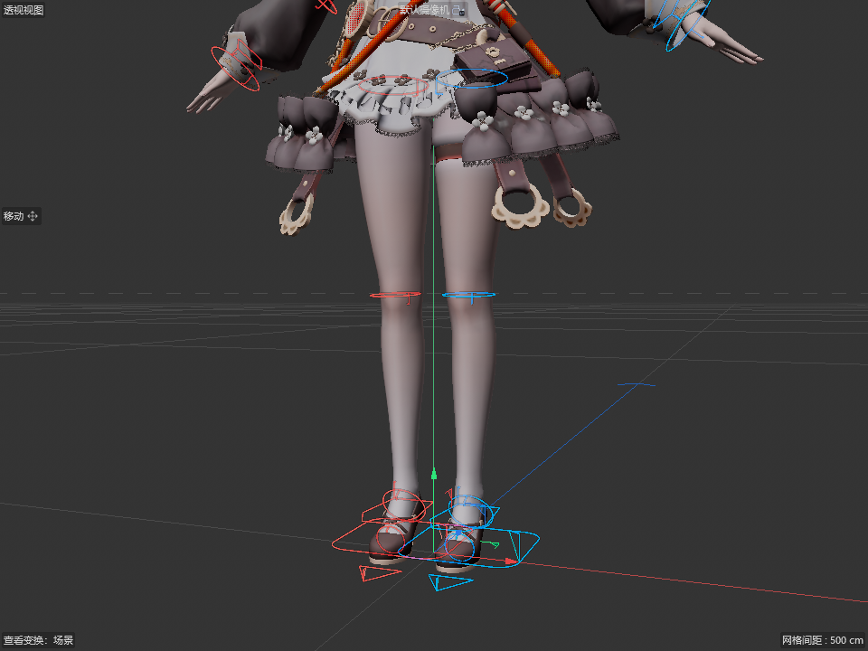

# MMD 控制器：2026-10-08 验收与 0.9.2.3 Windows 出包

本次合并完成原生 PSR 驱动修复、控制器外观与模型属性设置，以及腿脚和 IK 控制器。
Windows 安装包为本地交付，未创建远端发行。用户模型和 VMD 未纳入 Git 或安装包。

## 行为与使用

模型进入动画模式后，在“控制器”属性页点击“创建 / 刷新控制器”。左右分别为青蓝、珊瑚红；
腿、膝盖、脚踝使用圆环，足 IK 使用脚形框、脚尖 IK 使用三角、IK 父级使用圆角框。
固定轴优先使用菱形。默认主要控制器模式；需要辅助骨时切换“全部”，整体尺寸范围 25%–300%。
穿透显示提供连续轮廓，原生 spline 仍负责选取。阿芙生成 40 个控制器，主要模式显示 32 个。

拖动 IK 控制器沿原模型的 IK 链求解。未登记的 FK 旋转接管对应链，归零后恢复 IK；
登记后的 FK 姿势通过 C4D 动画槽的 authored-pose 标记保持，仍可继续调整和保存重开。
向其他软件输出最终 FK 姿势应使用烘焙导出；该内部标记不是 VMD 原生字段。

## 验证范围

| 验证 | 结果 |
|---|---|
| 阿芙 PMX：物理关 / 开 | 各 63 项，合计 126 项通过 |
| 阿芙 PMX＋Stay Tonight VMD，第 300 帧起：物理关 / 开 | 各 63 项，合计 126 项通过 |
| 模型面板、显示、尺寸、选择、撤销、刷新和存档 | 27 项通过 |
| 原生 PSR：PMX / PMX＋VMD | 各 90 项，合计 180 项通过 |
| 骨骼单独登记 FK 关键帧 | 控制器归零，姿态误差小于 1e-4 |
| 标准腿骨带固定轴标记 | 刷新后保留菱形轮廓 |
| SDK 独立单元与 fixture 检查 | 20/20 通过 |
| Windows SDK Release | R20、R21、R23、R25、2023、2024、2025、2026 编译及产物审计通过 |
| Inno 隔离安装、覆盖安装、卸载 | 11 个组件，869 个实际 Release 文件校验通过 |

原生宿主为 Cinema 4D 2026.4（2026400），回归桥 OFF，真实 MCP/Python 主线程求值。
旧 SDK 只有编译和资源检查，没有旧版宿主实测；本次不包含 macOS 构建。
安装生命周期使用维护模板、独立 AppId 和隔离的 C4D 目录；没有把发行 EXE 安装到用户正在使用的目录。

## 可追溯产物

- [提交内检查回执](receipts/controllers-20261008.json)：各项判断、输入 hash、8 个 SDK 二进制 hash、安装包 hash 与测试边界。
- 本地交付目录：`output/controllers-0.9.2.3/`；包含安装包、SHA256SUMS、3 个私有 C4D 演示场景、截图和完整 evidence。
- 原生加载的 SDK 2026 模块 SHA-256：`b5fd82babf2cafdcf7e39a3890b3bf9a8a2ee97f4874bd82913159e14dcd7bff`。
- 维护源码/资源指纹：`427a879bd22f6dee8c48d32ac424a9a5d19f1509f215d8dcd4632f3979b0a9eb`。
- 安装包：`MMD-Tool-v0.9.2.3-Windows-x64-Setup.exe`，SHA-256：`3334426a7421314970ed51804f4bd0ab5eaff15479b07c27316b690f324934d5`。

源码定位：`mmd_bone_control_util.cpp` 管理角色、轮廓与输入换算；`mmd_model_runtime.cpp` 处理约束采样和 FK/IK 所有权；
`native_control_presentation_test.py`、`native_leg_control_test.py` 和 `native_external_psr_test.py` 是可重复的原生验证入口。
