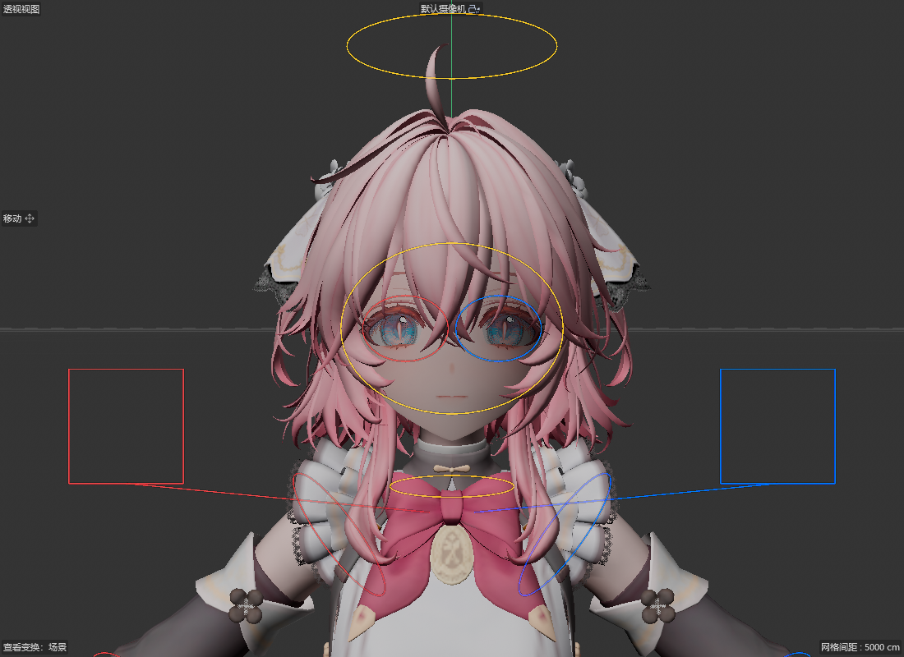

# 眼睛控制器、悬停名称与编辑模式显示

重新导入 PMX 时，控制器先前通过 `SetMg` 后读取局部矩阵再冻结变换。新对象的局部变换可能还没有刷新，眼睛控制器因此落到了头部父骨骼的位置。现在从冻结骨骼层级合成初始矩阵，并直接计算和写入控制器的冻结局部变换。坐标换算保留模型缩放；双眼轮廓移到真实眼睛的中点，旋转轴仍保留在 PMX 作者指定的位置。

环形和椭圆控制器不再生成方向三角形。肩部引线、手部线框盒、脚尖 IK 的三角轮廓仍保留。

鼠标距可见控制器线框六个屏幕像素以内时，SceneHook 的原生 `GetCursorInfo` 返回当前命名模式下的骨骼名称。重叠时取最近的边，隐藏对象、隐藏父级及关闭样条显示时不提示。它不改动选取或拖动工具。

编辑模式隐藏生成控制器和提示；动画模式恢复“主要 / 全部 / 隐藏”设置。编辑模式点击创建或刷新时保持骨骼显示，不切换到仅控制器显示。

验证记录见 [完整收据](receipts/controllers-eye-hover-20261009/receipt.json)。

- Cinema 4D 2026.4 的 110 项原生检查通过：54 项展示、动画和存档回归，28 项默认缩放交互检查，以及 28 项缩放为 1、移动和旋转模型后的交互检查。
- 悬停回归调用实际 SceneHook 游标回调，覆盖透视 / 正视和不同镜头距离、名称切换、隐藏对象、隐藏父级及样条显示过滤。没有截取操作系统弹出的提示气泡。
- `control_role_test` 和 `control_hit_test` 通过。
- SDK 2026 Debug 测试构建和关闭回归桥的 Release 构建通过。最后的编辑模式刷新按钮显示修正已编译，未再次重启原生宿主单独复测。
- 修复阶段初次 R20 尝试受并行 motion-sizing 文件的旧版 source processor 错误阻挡。发行阶段已通过独立源码的 R20 编译及全平台线上矩阵；macOS／旧版宿主的原生运行时仍未验证。

测试过程中复用同一宿主进行重复导入、模式切换及存档检查。原生插件二进制改变时仍需要加载新构建；当前生成工程未启用 Visual Studio 的 `/ZI` 与增量链接，因此没有使用 C++ Hot Reload。

修复阶段完成后，已随 [0.9.3.2](https://github.com/AiMiDi/C4D_MMD_Tool/releases/tag/v0.9.3.2) 发布。
发行阶段的干净 R20 Release 编译、21 项线上 SDK／平台构建及 9 个下载资产校验均通过，
见 [发布收据](../releases/0.9.3.2-publication.json)。主 README 保留最近三个版本，完整历史仍在 Changelog 文档中。
其他任务的 motion-sizing 修改保持在工作树中，没有纳入本次发行标签。
