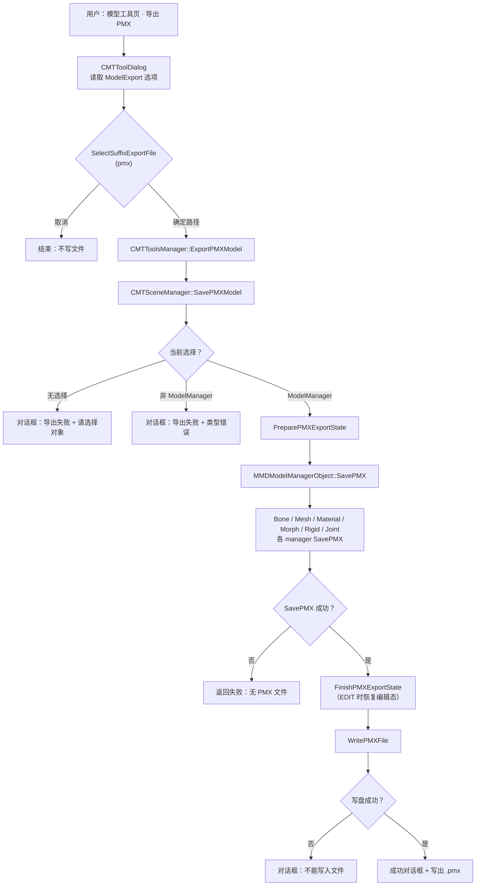
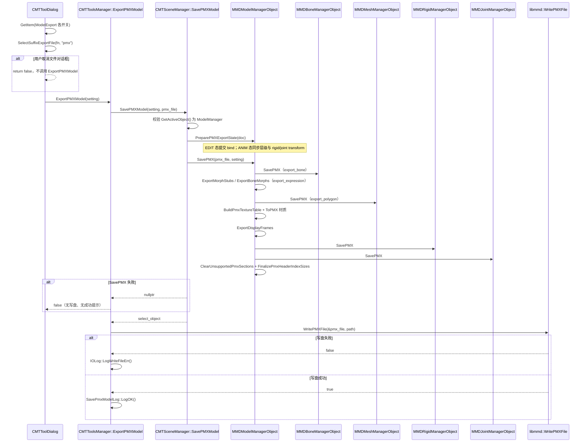
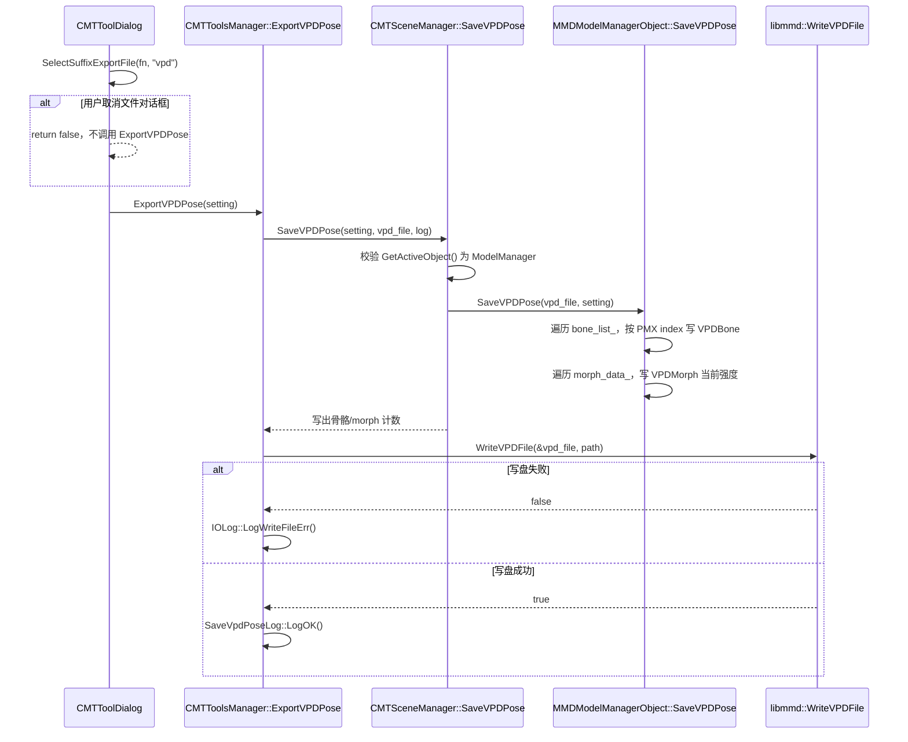

# 导出流程

本文整理当前 **PMX 模型导出** 与 **VPD 姿势导出** 链路。PMX 导出是「从插件管理的 MMD 模型重建 `libmmd::PMXFile` 并写出」，不是任意 C4D 场景转 PMX；VPD 导出是「把选中 MMD 模型当前时间点的骨骼/表情姿势快照写成 `libmmd::VPDFile`」。导入侧见 [`import-flow.md`](import-flow.md)；运行时重建、动画/IK/物理执行见 [`runtime-flow.md`](runtime-flow.md)。

## 关键代码地图

| 区域 | 主要职责 |
|---|---|
| `source/module/ui/cmt_tools_dialog.cpp` | 模型工具页 UI：读取 `ModelExport` / `PoseExport` 选项，调用 `SelectSuffixExportFile(..., "pmx" / "vpd")` 与 tools manager |
| `source/cmt_tools_manager.cpp` | `CMTToolsManager::ExportPMXModel` / `ExportVPDPose`：分配 libMMD 文件对象，调用场景保存，再写盘 |
| `source/CMTSceneManager.cpp` | `CMTSceneManager::SavePMXModel` / `SaveVPDPose`：校验当前选择为 `MMDModelManagerObject` 并调用模型管理对象 |
| `source/module/tools/object/mmd_model_manager.cpp` | `MMDModelManagerObject::PreparePMXExportState` / `SavePMX` 编排 PMX section；`SaveVPDPose` 采样当前骨骼和 morph 快照 |
| `source/module/tools/object/mmd_bone_manager.cpp` | `MMDBoneManagerObject::SavePMX`：骨骼 flags、tail、append、axis、IK target/link/limit、层级；动态 IK link 解析会先检查 `GeData` 类型 |
| `source/module/tools/object/mmd_mesh_manager.cpp` | `MMDMeshManagerObject::SavePMX`：顶点、面、法线、UV、权重、材质面范围；优先从 PoseMorph base 采样未动画形变的基准点位 |
| `source/module/tools/object/mmd_rigid_manager.cpp` | `MMDRigidManagerObject::SavePMX`：刚体绑定骨骼、形状与物理参数 |
| `source/module/tools/object/mmd_joint_manager.cpp` | `MMDJointManagerObject::SavePMX`：关节类型、刚体 A/B 引用、限制与 spring 参数 |

## 总览

v1 PMX 导出采用 **重建式导出**：不保存原始 PMX blob，也不 patch 未知扩展段；由当前 C4D 对象树与 BaseContainer 中已持久化的 PMX 参数组装新的 `libmmd::PMXFile`。导出对象必须是场景中选中的 `MMDModelManagerObject`（及其子 manager 数据），不能把普通 Polygon/Joint 场景一键转成 PMX。



## PMX 模型导出



`MMDModelManagerObject::SavePMX()` 的 section 调用顺序与 PMX 依赖一致：

1. header / info（模型名、注释、版本等）
2. bones（`export_bone`）
3. morph stubs + bone morphs（`export_expression`）
4. mesh：vertices、faces、normals、UV、weights（`export_polygon` 及子开关）
5. textures + materials（`export_material`，先建去重贴图表再写材质 index）
6. display frames（依赖已导出的 bone/morph index）
7. rigid bodies → joints
8. `ClearUnsupportedPmxSections()`（清空 softbody）并 `FinalizePmxHeaderIndexSizes()`

导出完成后的 PMX 结构与导入侧对象树对应：

```text
libmmd::PMXFile（新建）
  m_bones          ← MMDBoneManagerObject::SavePMX
  m_morphs         ← morph stubs + bone morphs
  m_vertices/faces ← MMDMeshManagerObject::SavePMX
  m_textures/materials ← ModelManager 材质列表 + ToPMX
  m_displayFrames  ← display_frame_list_
  m_rigidBodies    ← MMDRigidManagerObject::SavePMX
  m_joints         ← MMDJointManagerObject::SavePMX
  m_softbodies     ← v1 始终为空
```

## VPD 姿势导出

VPD 导出入口有两处：工具窗口动作页的 **姿势(VPD)** 分组，以及 `OMMDModelManager` 的动画分组 `导出VPD` 按钮。工具窗口入口使用当前选中的 `MMDModelManagerObject`；模型管理器入口直接作用于该对象本身。它不重建 PMX section，也不导出 VMD 动画曲线；它只保存目标模型在当前文档时间点的静态姿势：

- 骨骼：按 PMX 骨骼 index 排序写入所有已链接骨骼，使用 PMX 本地骨骼名；零平移/单位旋转骨骼也保留。
- 表情：写入所有 morph 控制器当前强度，包含 0 权重；group / flip morph 只保存控制器强度，不展开成运行时贡献。
- EDIT 模式：导出当前可编辑对象相对矩阵中的姿势，不切换模式，不提交 animation slot。
- ANIM 模式：优先使用当前播放求值后的 runtime override；若骨骼没有 override，则回退到对象当前相对矩阵。
- 导出过程只读当前对象状态，不修改 animation slot、CTrack、关键帧或 PMX bind 数据。



模型管理器动画分组还提供两个当前帧辅助按钮：

- `注册当前状态`：只把当前文档帧相对当前动画求值发生变化的骨骼姿势和 morph 强度写入当前 animation slot；没有动画槽且确实存在变化时会创建一个。VPD 导入形成的当前帧临时姿势、手动控制器偏移和手动调整过的 morph 值会被视为变化；未变化的骨骼/表情不会被补零或补单位旋转 key。ANIM 模式注册后会继续保持当前帧的临时 pose override，直到播放/跳帧清理，避免同一帧立刻被普通动画/IK 求值改写可见姿势。
- `删除当前帧关键帧`：从当前 animation slot 删除当前帧骨骼 key，并删除当前帧 morph CTrack key；不影响其他帧和其他 animation slot。

与 VMD 导出的区别：VMD 导出遍历已存在的动画轨道并写出多帧曲线；VPD 导出只取当前时间点的姿势快照，不要求模型存在动画轨道，也不会生成帧号、插值或 camera/light/self-shadow 数据。与 PMX 导出的区别：VPD 不写 mesh、材质、刚体、关节、display frame 或 IK 结构，只依赖当前模型树已有骨骼/morph 控制器。

VPD 写入前在 `source/module/tools/object/mmd_model_manager.cpp` 内把 C4D `Vector` / `Matrix` 转成 libMMD `Eigen::Vector3f` / `Eigen::Quaternionf`。该转换与 VPD 导入使用的 translation/quaternion 口径保持一致。

## v1 范围与限制

| 限制 | 说明 |
|---|---|
| 非任意 C4D→PMX | 仅支持由本插件导入并维护的 `MMDModelManagerObject` 树；普通 mesh/skin/joint 不能导出为 PMX |
| 无 softbody | `ClearUnsupportedPmxSections()` 会清空 `m_softbodies`；导入时若存在 softbody 段，v1 不写出 |
| 无未知扩展透传 | 不保存原始 PMX blob，未知 section / 扩展数据不会无损回写 |
| SDEF / QDEF 非无损 | QDEF 无法从 C4D 权重重建；SDEF 仅在 mesh 上存在 `SDEF_C` / `SDEF_R0` / `SDEF_R1` 顶点色 tag 时按 SDEF 写出，否则退化为 BDEF2/BDEF4 等可表达权重 |
| 不 bake 运行时动画 | 导出的是当前编辑态/绑定态下的静态 PMX 参数，不把逐帧 IK/物理求解结果写入 PMX |
| 选项组合 | `export_polygon` 与 `export_material` 需保持一致：仅 polygon 时会自动追加默认材质；仅 material 时 `num_face_vertices=0`；关闭 bone 时权重/刚体 section 可能不完整 |
| Common toon | `toon_mode == Common` 时 PMX 写入 0..9 共用 slot，**不**进入 `m_textures` 表 |

## 导出前状态同步（Export-before-sync）

`PreparePMXExportState()` 在 `SavePMX()` 之前提交当前编辑快照；`SavePMXModel` 在写盘前调用 `FinishPMXExportState()`，**不会**把 `MODEL_MODE` 永久切到 ANIM。

**MODEL_MODE_EDIT**：`PreparePMXExportState` 返回 `true`，调用 `CommitEditModeBindState()`（同步骨骼 bind、mesh bind pose、刚体/关节 transform），子 manager 临时进入 ANIM 采集数据；导出结束后 `FinishPMXExportState` → `RestoreBindStateForEdit()`，UI 仍停留在 EDIT。

**MODEL_MODE_ANIM**：`PreparePMXExportState` 返回 `false`，不恢复；执行 `SynchronizeBoneHierarchy` 与刚体/关节 `CommitEditorTransforms`。导出前会临时清零插件记录的 morph 强度并在导出结束恢复，避免当前动画 slot 的表情强度影响导出的静态 PMX。

**网格写出**：四边 `CPolygon` 拆成 `(a,b,c)` + `(a,c,d)` 两个三角面；每个 corner 仍保留独立映射供 morph 回填，但最终 PMX 顶点按 position、normal、UV、edge scale、weight/SDEF 数据组成的属性 key 去重，因此可以跨材质分片合并同一顶点，同时保留 per-corner UV/法线 seam。position 优先读取 `CAPoseMorphTag` 的第 0 个 base morph point node；如果找不到 base morph，则回退到当前 `PolygonObject::GetPointR()`。

**morph 写出**：mesh morph 从 PoseMorph 相对 offset 还原为 PMX morph；当多个 C4D corner 经属性去重映射到同一个 PMX 顶点时，同一个 morph 只写一次 target，避免重复 offset 放大文件体积。

**IK 写出**：IK target 与 IK link 优先通过 `BaseLink` 解析当前骨骼 index；只有 `GeData::GetType() == DA_ALIASLINK` 时才调用 `GetBaseLink()`，避免 Debug SDK 对非 link 数据触发 `0x80000003` 断点。若结构化 dynamic description parent-group 解析不到有效 link，会回退到运行时 IK 使用的字段名/浏览顺序解析，兼容旧场景。

**刚体/关节 index**：刚体按 `RIGID_INDEX` 排序后连续写出，并建立 `rigid_index → 导出序号` 映射；关节 `JOINT_LINK_RIGID_*_INDEX` 经该映射后再写入 PMX。

**骨骼 morph**：`ExportBoneMorphsToPMX` 遍历 `BuildOrderedBoneObjectList` 全层级骨骼，不只根下第一层。

## 失败路径（可验证）

| 触发条件 | 代码位置 | 用户可见结果 | 是否写出文件 |
|---|---|---|---|
| 未选中任何对象 | `SavePMXModel`：`select_object == nullptr` | `GePrint` + `MessageDialog`：`IDS_MES_EXPORT_ERR` + `IDS_MES_SELECT_ERR` | 否 |
| 选中对象不是 `MMDModelManagerObject` | `SavePMXModel`：`!IsInstanceOf(g_mmd_model_manager_object_id)` | `GePrint` + `MessageDialog`：`IDS_MES_EXPORT_ERR` + `IDS_MES_EXPORT_TYPE_ERR`（文案沿用相机导出字符串） | 否 |
| `SavePMX()` 返回 false | `SavePMXModel` → `ExportPMXModel` 提前返回 | 无额外错误对话框；`ExportPMXModel` 返回 false | 否（未调用 `WritePMXFile`） |
| `WritePMXFile` 失败 | `ExportPMXModel` | `IOLog::LogWriteFileErr()`：`IDS_MES_EXPORT_ERR` + `IDS_MES_EXPORT_WRITE_ERR` | 否（或残留不完整文件，取决于 libMMD 写盘行为） |
| 文件对话框取消 | `SelectSuffixExportFile` 返回 false | 无消息；`CMTToolDialog::Command` 直接 `return false` | 否（未进入 `ExportPMXModel`） |
| 成功 | `WritePMXFile` 成功 | `SavePmxModelLog::LogOK()` | 是 |

验证建议：

- **无选择**：清空选择后点导出 → 应弹出「导出失败:请选择对象」类提示，目录中无新 `.pmx`。
- **非 MMD 选择**：选中普通 Null/Camera 后导出 → 类型错误对话框，无新文件。
- **取消对话框**：点导出后在保存对话框点取消 → 无对话框、无新文件（可在导出前后对比目标目录时间戳）。
- **SavePMX 失败**：需构造非法数据或关闭必要 section 导致 manager 返回 false（自动化见 tasks 4.x）；现象为无成功提示、无新文件。
- **写盘失败**：指向只读路径或无效路径 → 「不能写入文件」对话框。

## 手动验收清单（tasks 5.1–5.3）

### 5.1 PMX 往返导入

- [ ] 在 Cinema 4D 中通过模型工具 **导入 PMX**（记录源文件路径）。
- [ ] 在对象管理器中 **选中** 生成的 `MMDModelManagerObject`（模型根）。
- [ ] 打开 **C4D MMD Tools → 模型** 页，展开 **导出模型(PMX)**，保持默认导出选项（或全选），点击 **导出**，选择新路径（例如 `model_export_roundtrip.pmx`）。
- [ ] 确认出现成功提示（或至少目标路径下生成 `.pmx` 且时间戳更新）。
- [ ] **新建文档** 或移走原 ModelManager，再次用 **导入 PMX** 导入刚导出的文件。
- [ ] 通过：能完成导入；骨骼数量、mesh 可见、材质大致正常；无立即崩溃或空模型。

### 5.2 EDIT 态编辑后导出

- [ ] 导入 PMX 后，将 ModelManager 置于 **EDIT** 模式（与运行时文档一致的模式切换）。
- [ ] 修改至少一项：**骨骼** frozen 位置、**刚体** 对象位置/旋转、或 **关节** 对象 transform（或对应参数面板）。
- [ ] **不要** 手动切到 ANIM：EDIT 下直接导出后，`MODEL_MODE` 应仍为 EDIT（`FinishPMXExportState` 恢复）。
- [ ] 用 **重新导入** 导出的 PMX，或外部 PMX 查看器对比：骨骼/刚体/关节应与编辑后一致，而非编辑前的导入态。
- [ ] 可选：导出前后对比刚体 `shape position`、关节 `position` 等 PMX 字段。

### 5.3 中英文 UI 与资源配置

- [ ] **中文分组标题**：`res/S24_up/strings_zh-CN/dialogs/DLG_CMT_TOOL.str` → `IDS_CMT_TOOL_MODEL_EXPORT_GRP` =「导出模型(PMX)」。
- [ ] **英文分组标题**：`res/S24_up/strings_en-US/dialogs/DLG_CMT_TOOL.str` → `Model Export(PMX)`。
- [ ] **导出按钮**：`DLG_CMT_TOOL.res` 中 `DLG_CMT_TOOL_MODEL_EXPORT_BUTTON` 使用共享 `IDS_CMT_TOOL_EXPORT_BUTTON`（中「导出」/ 英 `Export`）。
- [ ] **选项 checkbox**：导出侧控件复用导入字符串 ID（`IDS_CMT_TOOL_MODEL_IMPORT_POLYGON` 等），在模型页导出分组内显示为多边形/法线/UV/材质/骨骼等选项。
- [ ] **错误与成功文案**：`res/S24_up/strings_*/c4d_strings.str` 中 `IDS_MES_EXPORT_ERR`、`IDS_MES_SELECT_ERR`、`IDS_MES_EXPORT_WRITE_ERR`；类型错误暂用 `IDS_MES_EXPORT_TYPE_ERR`（相机导出遗留文案）。
- [ ] **默认配置**：`res/S24_up/cmt_config.json` 含全部 `DLG_CMT_TOOL_MODEL_EXPORT_*` 键（`SIZE` 8.5，其余 bool `true`），与 `source/cmt_tools_config_manager.h` 默认一致。
- [ ] **运行时资源**：`cmake --build _build_msvc/sdk_2026 --config Debug --target mmdtool` 后检查 `_build_msvc/sdk_2026/bin/Debug/plugins/mmdtool/res/cmt_config.json` 与 `.../res/strings_zh-CN/`、`strings_en-US/` 是否同步；打开 **C4D MMD Tools → 模型** 页，导出分组标题/按钮/选项与配置一致。
- [ ] 切换 C4D 界面语言后确认无裸露 symbol ID。

## 导出问题定位

| 症状 | 优先检查 |
|---|---|
| 点导出无任何文件 | 是否取消文件对话框；`SavePMX` 是否返回 false；`ExportPMXModel` 是否未走到 `WritePMXFile` |
| 提示请选择对象 | `GetActiveObject()` 是否为空 |
| 提示类型错误但选中的是模型 | 是否选中了子对象而非 ModelManager 根；`g_mmd_model_manager_object_id` 是否匹配 |
| 写出 PMX 但 MMD 无法打开 | `FinalizePmxHeaderIndexSizes`、材质 face 总数与 mesh 面数；libMMD 读回测试（tasks 4.x） |
| 权重/SDEF 与源 PMX 不一致 | v1 预期：QDEF 不重建；无 SDEF 顶点色 tag 时降级为 BDEF；见 `MMDMeshManagerObject::AssignVertexWeights` |
| 导出后保持当前闭眼/表情 | 检查 `PreparePMXExportState` 是否清零并恢复 morph 强度；mesh 是否从 PoseMorph base morph 点位读取，而不是当前动画评估后的对象点 |
| 导出文件比源 PMX 明显大 | 检查属性级顶点去重是否生效；若材质分片 seam、UV/normal 或权重不同，PMX 顶点仍需要拆分，这是预期 |
| 重新导入后 IK 失效 | 检查 `PMX_BONE_IK_TARGET_BONE_LINK`、IK link dynamic description 和 `CollectPmxIkLinks` fallback；非 link 类型参数不能直接调用 `GetBaseLink()` |
| 刚体/关节与编辑不一致 | 导出前是否执行 `PreparePMXExportState` / `CommitEditorTransforms`；是否仍在 EDIT 且未触发提交 |
| softbody 丢失 | v1 设计：`m_softbodies` 被清空，非回归 |
| VPD 文件中没有动画曲线 | VPD 只保存当前姿势快照；需要多帧骨骼/morph 动画时应使用 VMD 导出 |
| VPD 表情没有展开 group/flip | 设计为保存控制器当前强度，不展开运行时贡献；检查 `MMDModelManagerObject::SaveVPDPose` 的 morph 遍历 |

本页使用 Mermaid 作为流程图格式，与 [`import-flow.md`](import-flow.md) 保持一致，便于 diff 与审查。
