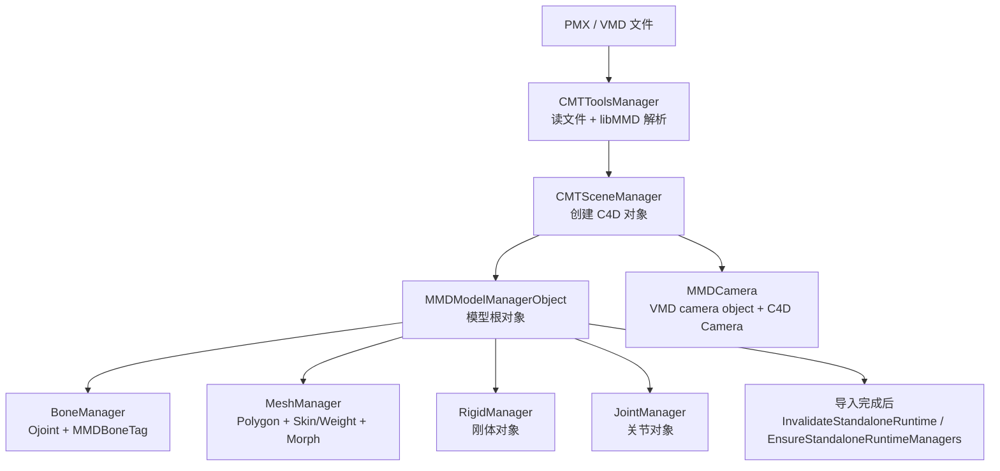
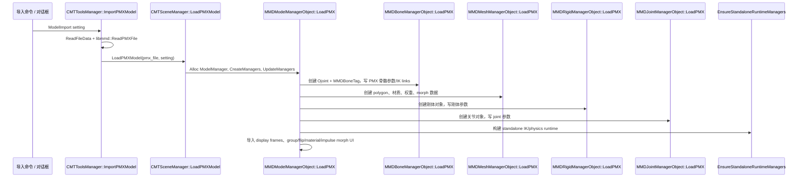
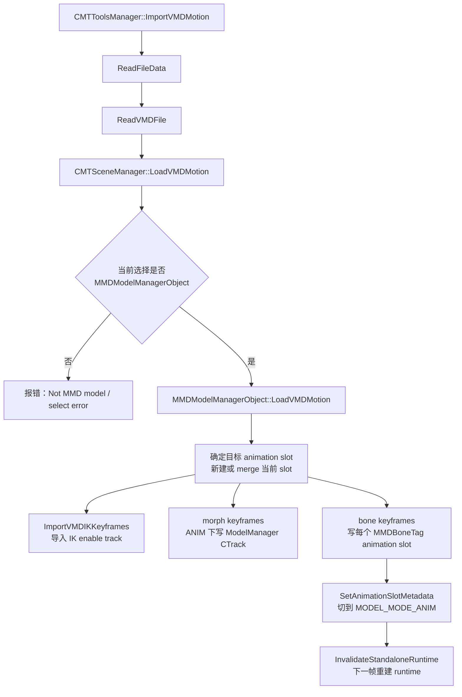
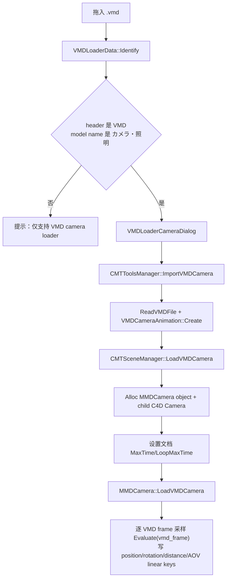

# 导入流程

本文整理当前 PMX 模型、VMD 动作、VMD 相机导入链路。运行时重建、每帧动画/IK/物理执行见
[`runtime-flow.md`](runtime-flow.md)。

## 关键代码地图

| 区域 | 主要职责 |
|---|---|
| `source/cmt_tools_manager.cpp` | 工具层入口：读 PMX/VMD 文件，调用场景管理器 |
| `source/CMTSceneManager.cpp` | 场景层入口：创建 ModelManager / Camera 对象并派发导入 |
| `source/module/tools/object/mmd_model_manager.cpp` | 模型根对象：创建子 manager、导入模型元数据、动画槽和 morph UI |
| `source/module/tools/object/mmd_bone_manager.cpp` | 骨骼导入：创建 `Ojoint` 和 `MMDBoneTag`，维护骨骼索引 |
| `source/module/tools/tag/mmd_bone.cpp` | 骨骼 tag：保存 PMX 骨骼参数、IK links、VMD 动画槽 |
| `source/module/tools/object/mmd_mesh_manager.cpp` | 网格导入：创建 polygon、权重、材质 tag、pose morph 数据 |
| `source/module/tools/object/mmd_rigid_manager.cpp` | 刚体导入：创建刚体对象并保存 PMX rigid 参数 |
| `source/module/tools/object/mmd_joint_manager.cpp` | 关节导入：创建 joint 对象并保存 PMX joint 参数 |
| `source/module/tools/object/mmd_camera.cpp` | VMD camera 对象：采样 `VMDCameraAnimation` 并写 C4D tracks |
| `source/module/tools/loader/vmd_loader.cpp` | C4D scene loader 入口：拖入 VMD 时识别 camera VMD |

## 总览



导入阶段的职责是把外部 PMX/VMD 数据转换成可持久化的 C4D 对象、参数、动态描述和动画槽。IK solver、
Bullet rigid body、joint constraint 等 runtime 对象不是导入文件的持久化结果，而是在导入完成后或下一帧运行时由
ModelManager 重建。

## PMX 模型导入



导入完成后的对象关系大致是：

```text
MMDModelManagerObject
  MMDBoneManagerObject
    Ojoint + MMDBoneTag
    Ojoint + MMDBoneTag
  MMDMeshManagerObject
    PolygonObject + CAWeightTag/CAPoseMorphTag/TextureTag...
  MMDRigidManagerObject
    MMDRigidObject...
  MMDJointManagerObject
    MMDJointObject...
```

PMX 导入的关键顺序不能随意交换：

1. `CMTToolsManager::ImportPMXModel()` 只负责文件 IO 和 `libmmd::ReadPMXFile()`。
2. `CMTSceneManager::LoadPMXModel()` 创建 ModelManager，先 `CreateManagers()` / `UpdateManagers()`，再调用 `LoadPMX()`。
3. `MMDModelManagerObject::LoadPMX()` 先 `InvalidateStandaloneRuntime()`，再导入 bone/mesh/rigid/joint。
4. 骨骼导入会创建 C4D `Ojoint`，给每根骨骼加 `MMDBoneTag`，写入 PMX flags、append、IK target/link、IK chain limit 等参数。
5. 网格导入依赖 `bone_list` 来建权重；刚体导入也用 `bone_list` 和 BoneManager 解析绑定骨骼。
6. 刚体和关节对象先作为可编辑 C4D 对象存在，真正的 Bullet/libMMD runtime 在 `EnsureStandaloneRuntimeManagers()` 里重建。
7. 如果任何子导入失败，`CMTSceneManager::LoadPMXModel()` 会移除本次新增材质和 ModelManager，避免半成品留在场景里。

## 骨骼导入细节

`MMDBoneManagerObject::LoadPMX()` 先为每个 PMX bone 分配一个 C4D `Ojoint`，再逐个写参数：

- 名称、本地名/英文名显示选项。
- PMX 位置，根骨骼直接写 frozen pos，子骨骼写相对父骨骼的 frozen pos。
- deform layer、rotatable、translatable、visible、enabled、deform-after-physics。
- append rotation / append translation 的 source link 和 influence。
- fixed axis、local axis。
- IK target link、iteration、unit angle、IK chain links 和 limit 动态描述。
- bone morph 数据。

完成后会同步骨骼层级和骨骼索引，并广播描述检查更新。后续 runtime adapter 的初始矩阵会从这些
frozen/bind 状态读取。

## 网格、刚体、关节导入细节

`MMDMeshManagerObject::LoadPMX()` 负责 polygon、材质、权重和 morph 数据。它依赖前面产生的
`bone_list` 来建立权重绑定，因此 PMX 导入顺序里骨骼必须先于网格。

`MMDRigidManagerObject::LoadPMX()` 会创建 `MMDRigidObject`，写入：

- rigid index、名称、组、碰撞过滤。
- 绑定骨骼 index。
- shape type、shape size、shape transform。
- physics mode、mass、friction、repulsion、damping 等物理参数。

`MMDJointManagerObject::LoadPMX()` 会创建 `MMDJointObject`，写入：

- joint index、名称、类型。
- rigid A/B index。
- joint transform、位置/旋转限制、spring 参数。

这些对象导入后仍只是 C4D 侧持久化参数；runtime rigid body 和 runtime joint 在
`MMDModelManagerObject::BuildStandalonePhysics()` 中按 index 排序重建。

## VMD 动作导入

VMD 动作导入要求当前选择对象是 `MMDModelManagerObject`：



骨骼动作不是直接写 C4D track，而是转为 `BoneAnimationKeyframeData` 存在每个 `MMDBoneTag` 的动画槽中。
`LoadVMDMotion()` 会按骨骼名查找目标 tag，支持本地名/英文名导入；遇到 append/inherit 骨骼会跳过直接导入，
因为这些骨骼应由运行时继承链计算。`setting.ignore_physical` 打开时，动态物理驱动骨骼也会跳过 VMD 写入。

Morph 动作在 ANIM 模式下仍以 ModelManager 上的 CTrack 作为运行时数据源。进入 EDIT 模式时，这些 CTrack 会
被缓存到 EDIT 专用 morph slot 后删除，方便调试 morph 强度和编辑动态 UI；从 EDIT 切回 ANIM 时再按当前动画
slot 重建 CTrack。morph 定义和动态 UI 不因模式切换删除。

导入结束会：

- 更新动画槽名称和最大帧。
- 把 `animation_index_` 切到目标槽。
- 调 `ApplyAnimationSlotSelection()`。
- 将 ModelManager 切到 `MODEL_MODE_ANIM`。
- 将 BoneManager 下所有骨骼切到 `BONE_MODE_ANIM`。
- `InvalidateStandaloneRuntime()`，让下一次运行时从新动画槽、IK 状态和物理设置重建。

## VMD 相机导入

拖入 VMD 时走 C4D scene loader，只支持识别 camera VMD：



这里有两个容易出错的时间语义：

- `VMDCameraAnimation::Evaluate(float)` 需要的是 VMD 帧号，不是 C4D 秒。
- `setting.time_offset` 同时影响生成 key 的时间和文档 `SetMaxTime()` / `SetLoopMaxTime()`。

当前 camera 导入按 30fps VMD 帧逐帧 bake C4D tracks，并把导入 key 设为 `CINTERPOLATION::LINEAR`，
避免 C4D 默认曲线再平滑一次已经采样好的 VMD 曲线。

## 导入问题定位

| 症状 | 优先检查 |
|---|---|
| PMX 导入后对象不完整 | `CMTSceneManager::LoadPMXModel()` 是否在子导入失败后回滚；各 manager 的 `LoadPMX()` 返回值 |
| 骨骼层级或 IK link 不对 | `MMDBoneManagerObject::LoadPMX()` 的 parent、target link、IK chain dynamic description |
| 权重或材质缺失 | `MMDMeshManagerObject::LoadPMX()` 是否拿到完整 `bone_list`，材质导入选项和贴图路径是否有效 |
| 刚体/关节导入后运行时无效 | C4D 对象参数是否导入完整；runtime 侧见 `runtime-flow.md` 的 `BuildStandalonePhysics()` |
| VMD 动作导入无效 | 当前选中对象是否是 ModelManager；骨骼名匹配方式；是否被 inherit 或 dynamic physics 过滤 |
| VMD 相机轨迹不对 | `MMDCamera::LoadVMDCamera()` 是否用 VMD frame 调 `Evaluate()`；key 是否为 linear；`time_offset` 是否同时影响轨道和文档长度 |

本页使用 Mermaid 作为流程图格式，因为函数名、箭头和运行顺序需要可 diff、可维护、可审查。
