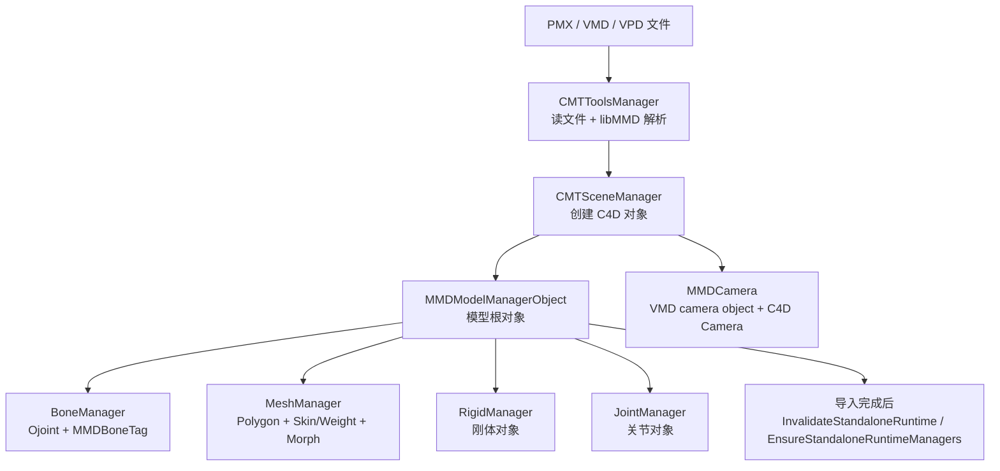
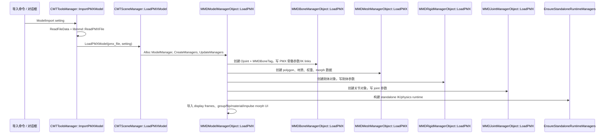
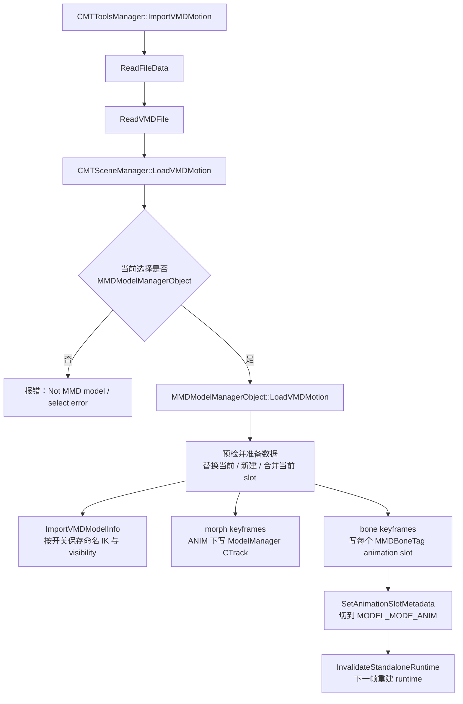
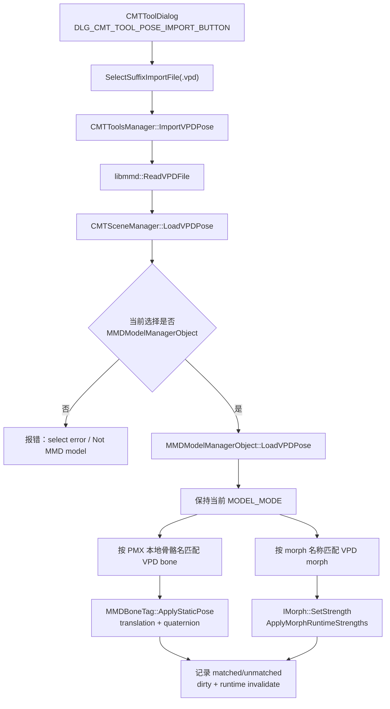
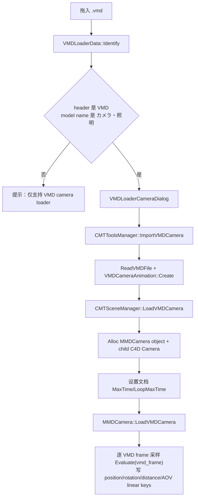

# 导入流程

本文整理当前 PMX 模型、VMD 动作、VPD 姿势、VMD 相机导入链路。运行时重建、每帧动画/IK/物理执行见
[`runtime-flow.md`](runtime-flow.md)。PMX 模型导出（重建式回写、导出前同步、v1 限制）见
[`export-flow.md`](export-flow.md)。

PMX 材质转换新增 `RS Toon（MMD 风格）`（持久化选择值 4），对应正式导入协议的 `material_type="redshift_toon"`。启用材质导入时先探测原生 Toon/Contour 配方；缺少所需节点或端口则在创建模型前返回原因。关闭材质导入时不要求 Toon 能力。普通 UV 主贴图与 Toon 着色均不依赖 Additional UV；基础值、使用方式和验收范围见 [RS Toon 材质](rs-toon-materials.md)。

## 关键代码地图

| 区域 | 主要职责 |
|---|---|
| `source/cmt_tools_manager.cpp` | 工具层入口：读 PMX/VMD/VPD 文件，调用场景管理器 |
| `source/CMTSceneManager.cpp` | 场景层入口：创建 ModelManager / Camera 对象并派发导入 |
| `source/module/tools/object/mmd_model_manager.cpp` | 模型根对象：创建子 manager、导入模型元数据、动画槽和 morph UI |
| `source/module/tools/object/mmd_bone_manager.cpp` | 骨骼导入：创建 `Ojoint` 和 `MMDBoneTag`，维护骨骼索引 |
| `source/module/tools/tag/mmd_bone.cpp` | 骨骼 tag：保存 PMX 骨骼参数、IK links、VMD 动画槽 |
| `source/module/tools/object/mmd_mesh_manager.cpp` | 网格导入：创建 polygon、权重、材质 tag、pose morph 数据 |
| `source/module/tools/object/mmd_rigid_manager.cpp` | 刚体导入：创建刚体对象并保存 PMX rigid 参数 |
| `source/module/tools/object/mmd_joint_manager.cpp` | 关节导入：创建 joint 对象并保存 PMX joint 参数 |
| `source/module/tools/object/mmd_camera.cpp` | VMD camera 对象：采样 `VMDCameraAnimation` 并写 C4D tracks |
| `source/module/tools/loader/vmd_loader.cpp` | C4D scene loader 入口：拖入 VMD 时识别 camera VMD |

## 总览


```mermaid
flowchart TD
    A["PMX / VMD / VPD 文件"] --> B["CMTToolsManager<br/>读文件 + libMMD 解析"]
    B --> C["CMTSceneManager<br/>创建 C4D 对象"]

    C --> D["MMDModelManagerObject<br/>模型根对象"]
    D --> E["BoneManager<br/>Ojoint + MMDBoneTag"]
    D --> F["MeshManager<br/>Polygon + Skin/Weight + Morph"]
    D --> G["RigidManager<br/>刚体对象"]
    D --> H["JointManager<br/>关节对象"]

    C --> I["MMDCamera<br/>VMD camera object + C4D Camera"]
    D --> J["导入完成后<br/>InvalidateStandaloneRuntime / EnsureStandaloneRuntimeManagers"]
```

导入阶段的职责是把外部 PMX/VMD 数据转换成可持久化的 C4D 对象、参数、动态描述和动画槽。IK solver、
Bullet rigid body、joint constraint 等 runtime 对象不是导入文件的持久化结果，而是在导入完成后或下一帧运行时由
ModelManager 重建。

## PMX 模型导入


```mermaid
sequenceDiagram
    participant UI as 导入命令 / 对话框
    participant TM as CMTToolsManager::ImportPMXModel
    participant SM as CMTSceneManager::LoadPMXModel
    participant MM as MMDModelManagerObject::LoadPMX
    participant BM as MMDBoneManagerObject::LoadPMX
    participant Mesh as MMDMeshManagerObject::LoadPMX
    participant RM as MMDRigidManagerObject::LoadPMX
    participant JM as MMDJointManagerObject::LoadPMX
    participant RT as EnsureStandaloneRuntimeManagers

    UI->>TM: ModelImport setting
    TM->>TM: ReadFileData + libmmd::ReadPMXFile
    TM->>SM: LoadPMXModel(pmx_file, setting)
    SM->>MM: Alloc ModelManager, CreateManagers, UpdateManagers
    MM->>BM: 创建 Ojoint + MMDBoneTag，写 PMX 骨骼参数/IK links
    MM->>Mesh: 创建 polygon、材质、权重、morph 数据
    MM->>RM: 创建刚体对象，写刚体参数
    MM->>JM: 创建关节对象，写 joint 参数
    MM->>RT: 构建 standalone IK/physics runtime
    MM->>MM: 导入 display frames、group/flip/material/impulse morph UI
```

导入完成后的对象关系大致是：

```text
MMDModelManagerObject
  MMDBoneManagerObject
    Ojoint + MMDBoneTag
    Ojoint + MMDBoneTag
  MMDMeshManagerObject
    PolygonObject + CAWeightTag/CAPoseMorphTag/TextureTag...
  MMDRigidManagerObject
    MMDRigidObject...
  MMDJointManagerObject
    MMDJointObject...
```

PMX 导入的关键顺序不能随意交换：

1. `CMTToolsManager::ImportPMXModel()` 只负责文件 IO 和 `libmmd::ReadPMXFile()`。
2. `CMTSceneManager::LoadPMXModel()` 创建 ModelManager，先 `CreateManagers()` / `UpdateManagers()`，再调用 `LoadPMX()`。
3. `MMDModelManagerObject::LoadPMX()` 先 `InvalidateStandaloneRuntime()`，再导入 bone/mesh/rigid/joint。
4. 骨骼导入会创建 C4D `Ojoint`，给每根骨骼加 `MMDBoneTag`，写入 PMX flags、append、IK target/link、IK chain limit 等参数。
5. 网格导入依赖 `bone_list` 来建权重；刚体导入也用 `bone_list` 和 BoneManager 解析绑定骨骼。
6. 刚体和关节对象先作为可编辑 C4D 对象存在，真正的 Bullet/libMMD runtime 在 `EnsureStandaloneRuntimeManagers()` 里重建。
7. 如果任何子导入失败，`CMTSceneManager::LoadPMXModel()` 会移除本次新增材质和 ModelManager，避免半成品留在场景里。

## 骨骼导入细节

`MMDBoneManagerObject::LoadPMX()` 先为每个 PMX bone 分配一个 C4D `Ojoint`，再逐个写参数：

- 名称、本地名/英文名显示选项。
- PMX 位置，根骨骼直接写 frozen pos，子骨骼写相对父骨骼的 frozen pos。
- deform layer、rotatable、translatable、visible、enabled、deform-after-physics。
- append rotation / append translation 的 source link 和 influence。
- fixed axis、local axis。
- IK target link、iteration、unit angle、IK chain links 和 limit 动态描述。
- bone morph 数据。

完成后会同步骨骼层级和骨骼索引，并广播描述检查更新。后续 runtime adapter 的初始矩阵会从这些
frozen/bind 状态读取。

## 网格、刚体、关节导入细节

`MMDMeshManagerObject::LoadPMX()` 负责 polygon、材质、权重和 morph 数据。它依赖前面产生的
`bone_list` 来建立权重绑定，因此 PMX 导入顺序里骨骼必须先于网格。

`MMDRigidManagerObject::LoadPMX()` 会创建 `MMDRigidObject`，写入：

- rigid index、名称、组、碰撞过滤。
- 绑定骨骼 index。
- shape type、shape size、shape transform。
- physics mode、mass、friction、repulsion、damping 等物理参数。

`MMDJointManagerObject::LoadPMX()` 会创建 `MMDJointObject`，写入：

- joint index、名称、类型。
- rigid A/B index。
- joint transform、位置/旋转限制、spring 参数。

这些对象导入后仍只是 C4D 侧持久化参数；runtime rigid body 和 runtime joint 在
`MMDModelManagerObject::BuildStandalonePhysics()` 中按 index 排序重建。

## 材质表情（Material Morph）

默认 Standard 与 Redshift 的 RGB/Alpha 契约、逐字段支持差异及 shader/graph 与实际图像证据见
[`material-support.md`](material-support.md)。贴图读取和节点连接成功不表示完整 MMD toon/sphere 外观已经对齐。

PMX 材质表情（`PMXMorphType::Material`）的完整链路：持久化数据、PMX round-trip、运行时材质合成、
ShaderData 贴图系数和材质 adapter 同步。

### 数据模型与持久化

- `MMDMaterialMorphOffset`（`source/module/tools/object/mmd_morph.h`）保存单条 PMX 材质偏移的全部字段：
  目标材质索引（`-1` 表示全部材质）、运算模式（Mul/Add）、diffuse、specular、specularPower、ambient、
  edgeColor、edgeSize、texture/sphere/toon factor。提供 `FromPMX` / `ToPMX` / `Read` / `Write`。
- `MaterialMorph` 内嵌 `maxon::BaseArray<MMDMaterialMorphOffset> m_offsets`，随现有
  `ReadMorph` / `WriteMorph` / `CopyMorph` 路径持久化，offset 与 strength 条目（`m_name` / `m_strength_id`）
  天然关联。
- **版本兼容**：`OMMDModelManager` 注册磁盘等级从 3 升到 4；`MaterialMorph::Read(hf, level)` 仅在
  `level >= 4` 读取 offset，旧场景（level < 4）读取为空列表。

### 导入 / 导出 round-trip

- 导入：`MMDModelManagerObject::LoadPMX()` 的 Material 分支从 `pmx_morph.m_materialMorph` 逐条
  `FromPMX` 填充 `MaterialMorph::m_offsets`，同时保留通用 morph strength UI。
- 导出：`ExportMorphStubs()` 的 Material 分支从持久化 offset `ToPMX` 重建 `m_materialMorph`，`-1` 原样保留。
- 材质删除时 `AdjustMaterialMorphIndicesAfterMaterialRemoval()` 修正/移除悬空索引；
  `ValidateMaterialMorphIndices()` 提供越界校验。libMMD 层 round-trip 由
  `dependency/libMMD/tests/PmxMaterialMorph.test.cpp` 覆盖。

### 运行时合成（非累积）

`ApplyMorphRuntimeStrengths()` 在 group/flip 展开得到有效强度后调用
`EvaluateMaterialMorphRuntime(strengths)`：

- 仅当存在带 offset 的材质表情时才接管链接材质，避免未使用该特性时覆盖用户材质。
- 每次从基础 `material_list_` 重新合成，**不回写基础数据**：按 PMX 规则用 mul/add 累加器
  （mul 初始 1、按 `lerp(1, offset, w)` 连乘；add 初始 0、按 `offset * w` 累加），最终
  `value = base * mulProduct + addSum`。`-1` 作用于全部材质，越界索引跳过。
- `material_runtime_checksum_` 做 dirty 判定，仅在有效状态变化时同步 C4D 材质。
- `material_morph_runtime_active_` 记录是否接管过运行时材质；删除最后一个 offset 或 material morph 后仍会
  执行一次基础状态合成，避免上一帧效果残留。
- **模式分离**：动画模式应用材质表情；EDIT 模式经 `ClearMorphRuntimeForEdit()` 把强度归零后再
  `ApplyMorphRuntimeStrengths()`，使运行时状态回到基础材质；runtime 效果只进入临时材质副本，不污染
  基础 `MMDMaterialData`。

### ShaderData 与 BaseShader 嵌套

- `MMDMaterialTextureMorphShader`（插件 ID `1068715`，`source/module/tools/material/mmd_material_morph_shader.*`）
  包装一个原始贴图 child shader：child 经 `InsertUnder` 挂在 wrapper 之下（`GetDown()` 取得），
  `Output()` 采样 child 后乘以预计算的有效系数；颜色通道使用 `diffuse RGB * texture factor RGB`，
  Alpha 通道使用 `diffuse alpha * texture factor alpha`，sphere 通道使用其 RGBA factor。
- **ShaderData 边界**：`Output()` 只读取 shader 自身参数（render-time 快照）和 child 采样结果，不读取或
  修改任何可变场景状态（不碰 `MMDModelManagerObject` / `MMDMaterialData` / `BaseMaterial`）。有效系数由
  运行时 evaluator 预计算后写入 shader 参数。

### 材质 adapter 同步

- 简单颜色/浮点字段（diffuse、alpha、specular、specularPower、ambient）经预计算后由 `SyncToMaterial()`
  → 各 adapter `SyncTo()` 更新。Standard 纯色通道直接更新 `Xcolor`；带贴图的 color/alpha 通道则把有效
  diffuse/alpha 与 texture factor 合并写入 wrapper，避免贴图材质漏掉 diffuse morph。
- 贴图系数经 `SyncRuntimeStateToMaterial()` → `MMDMaterialAdapter::SyncRuntimeState()`：Standard adapter
  按需安装/更新 wrapper shader（复用现有 shader 或从通道贴图路径新建 Bitmap 作为 child）。Standard
  通道映射为：base texture → `CHANNEL_COLOR` / `CHANNEL_ALPHA`，sphere texture → `CHANNEL_ENVIRONMENT`。
  sphere 的 RGB 与 alpha factor 写入 wrapper。PMX toon 是按光照取样的阴影 ramp，不能直接接到
  `CHANNEL_LUMINANCE`；Standard 近似保留 toon 路径与 factor 数据用于持久化和导出，尚未实现完整 toon 着色。
  新材质默认不启用发光；旧导入材质在显式同步时，仅对路径匹配且保持默认配置的 toon Bitmap 或本插件
  单 Bitmap child wrapper 执行一次关闭通道的迁移，保留 shader。迁移标记随材质保存，后续用户自定义或
  重新启用的发光不会被同步或 toon factor 修改。
- Redshift adapter 使用独立节点图同步 diffuse/texture RGB 与 Alpha 系数，并通过 Color Splitter 的 A
  接入 opacity；Octane/Corona 仍只同步现有简单字段。各渲染器未完成的字段及原生验证范围见材质支持矩阵。
- `edgeColor` / `edgeSize` 等当前材质系统未承载的字段仅保留数据用于 UI 编辑、场景持久化和 PMX 导出。

### UI 位置

材质表情编辑栏在 **ModelManager** 属性管理器（`MODEL_MATMORPH_GRP`）：材质表情列表（动态 CYCLE）→
偏移项列表（动态 CYCLE）→ 选中 offset 全部字段控件 + 添加/删除 offset 按钮。目标材质用单个动态 CYCLE，
首项「全部材质」映射 `-1`，其后为各材质名。运行时/着色相关的 focused 验证（强度归零和最后定义删除恢复、
重复求值不漂移、EDIT/ANIM 分离、贴图 wrapper child 保留、sphere factor、toon 元数据保留及误建发光迁移）依赖 C4D 运行时，
按既有约定走手动验证。

## VMD 动作导入

VMD 动作导入要求当前选择对象是 `MMDModelManagerObject`：


```mermaid
flowchart TD
    A["CMTToolsManager::ImportVMDMotion"] --> B["ReadFileData"]
    B --> C["ReadVMDFile"]
    C --> D["CMTSceneManager::LoadVMDMotion"]
    D --> E{"当前选择是否<br/>MMDModelManagerObject"}
    E -- 否 --> F["报错：Not MMD model / select error"]
    E -- 是 --> G["MMDModelManagerObject::LoadVMDMotion"]
    G --> H["预检并准备数据<br/>替换当前 / 新建 / 合并当前 slot"]
    H --> I["ImportVMDModelInfo<br/>按开关保存命名 IK 与 visibility"]
    H --> J["morph keyframes<br/>ANIM 下写 ModelManager CTrack"]
    H --> K["bone keyframes<br/>写每个 MMDBoneTag animation slot"]
    K --> L["SetAnimationSlotMetadata<br/>切到 MODEL_MODE_ANIM"]
    L --> M["InvalidateStandaloneRuntime<br/>下一帧重建 runtime"]
```

骨骼动作不是直接写 C4D track，而是转为 `BoneAnimationKeyframeData` 存在每个 `MMDBoneTag` 的动画槽中。
`LoadVMDMotion()` 会按骨骼名查找目标 tag，支持本地名/英文名导入；遇到 append/inherit 骨骼会跳过直接导入，
因为这些骨骼应由运行时继承链计算。`setting.ignore_physical` 打开时，动态物理驱动骨骼也会跳过 VMD 写入。

Morph 动作在 ANIM 模式下仍以 ModelManager 上的 CTrack 作为运行时数据源。所有动画槽都有持久化的
morph 和模型信息快照；切槽和保存前捕获活动轨道，切槽后重建目标轨道。进入 EDIT 会移除运行轨道，
从 EDIT 切回 ANIM 时再按当前槽重建。morph 定义和动态 UI 不因模式切换删除。

`delete_previous_animation=true` 替换当前槽并保留其他槽；关闭时新增独立槽；显式 merge 将输入合并到当前
槽，同名同帧由输入覆盖。骨骼、morph、模型信息三个开关独立控制输入。偏移使用整数 VMD 帧，输入的范围、
缩放、位置、四元数及 morph 浮点值在修改前预检。场景入口使用模型子树 Undo 分组，在返回失败时撤销该次
导入并恢复文档时间范围；预处理阶段先准备合并数组，减少提交阶段分配。

ModelManager 磁盘版本 5 在版本 4 数据尾部追加按名称存储的 IK 和 visibility 槽。旧文件已有的活动 CTracks
在重建前迁移，动态 DescID 和 solver index 不作为 IK 持久化身份。隐藏帧接管根对象可见性，重新显示、
切 EDIT 或进入无可见性数据的槽时恢复艺术家的 editor/render 可见性基线。

动作导出遵守频道开关、整数偏移和模型单位/导出单位转换。普通 VMD 槽保留原四元数 Bezier；旋转曲线
X/Y/Z 用于控制器 Euler 曲线采样，不是坐标轴转换。`use_bake=true` 克隆文档并通过 AliasTrans 重映射
对象与材质链接，在副本中按 30fps 顺序采集最终骨骼与 morph，源文档无需恢复模拟副作用。
导出模型信息时，烘焙结果关闭实际模型的 IK，避免再次求解。VMD 无法表达关闭物理或 PMX append 标志；
重放最终变形需要目标模型配置避免重复变形，不能据此保证任意目标模型的物理往返一致。

导入结束会：

- 更新动画槽名称和最大帧。
- 把 `animation_index_` 切到目标槽。
- 调 `ApplyAnimationSlotSelection()`。
- 将 ModelManager 切到 `MODEL_MODE_ANIM`。
- 将 BoneManager 下所有骨骼切到 `BONE_MODE_ANIM`。
- `InvalidateStandaloneRuntime()`，让下一次运行时从新动画槽、IK 状态和物理设置重建。

## VPD 姿势导入

VPD 姿势导入可以从工具窗口 `Pose Import (VPD)` 按钮进入，也可以从 `OMMDModelManager` 的动画分组
`导入VPD` 按钮进入。工具窗口入口要求当前选择对象是 `MMDModelManagerObject`；模型管理器入口直接作用于
当前模型管理器对象。VPD 是单帧静态姿势格式，不会创建 VMD animation slot，也不会写 CTrack/CKey。


```mermaid
flowchart TD
    A["CMTToolDialog<br/>DLG_CMT_TOOL_POSE_IMPORT_BUTTON"] --> B["SelectSuffixImportFile(.vpd)"]
    B --> C["CMTToolsManager::ImportVPDPose"]
    C --> D["libmmd::ReadVPDFile"]
    D --> E["CMTSceneManager::LoadVPDPose"]
    E --> F{"当前选择是否<br/>MMDModelManagerObject"}
    F -- 否 --> G["报错：select error / Not MMD model"]
    F -- 是 --> H["MMDModelManagerObject::LoadVPDPose"]
    H --> I["保持当前 MODEL_MODE"]
    I --> J["按 PMX 本地骨骼名匹配 VPD bone"]
    I --> K["按 morph 名称匹配 VPD morph"]
    J --> L["MMDBoneTag::ApplyStaticPose<br/>translation + quaternion"]
    K --> M["IMorph::SetStrength<br/>ApplyMorphRuntimeStrengths"]
    L --> N["记录 matched/unmatched<br/>dirty + runtime invalidate"]
    M --> N
```

骨骼匹配只使用 PMX 本地骨骼名：`MMDModelManagerObject::LoadVPDPose()` 从
`MMDBoneManagerObject::bone_list_` 取每个 `MMDBoneTag` 的 `PMX_BONE_NAME_LOCAL`，用 UTF-8 名称匹配
`VPDFile::m_bones`。匹配成功后，`MMDBoneTag::ApplyStaticPose()` 使用当前 bone pose 矩阵构造逻辑写
`Ojoint` 相对矩阵，并尊重 `PMX_BONE_TRANSLATABLE` / `PMX_BONE_ROTATABLE`。VPD translation 跟现有 VMD
bone keyframe 一样使用当前模型姿势空间，不额外乘 `MODEL_POSITION_MULTIPLE`；模型尺寸仍由 ModelManager
根对象缩放承担。

如果导入时模型处于 `MODEL_MODE_ANIM`，实现保持动画模式，不切到 `MODEL_MODE_EDIT`，也不删除或替换已有
VMD animation slot。匹配的骨骼会通过当前时间点 static pose override 保持为导入状态；匹配的 morph 会作为当前
morph strength 暂时显示。这个状态是“当前帧临时姿势”：如果用户没有点击 `注册当前状态`，下一次播放推进、
跳到其他时间或切换模式时会清理这次 VPD 临时记录，并回到当前动画槽/轨道在新时间点的求值结果。
需要把这个姿势写进动画时，由模型管理器动画分组的 `注册当前状态` 按钮显式写入当前帧关键帧。

Morph 匹配使用 `MMDModelManagerObject::morph_name_`。匹配成功后直接写当前 morph strength，再调用
`ApplyMorphRuntimeStrengths()` 复用现有 mesh、bone、group、flip、material、impulse morph 分发路径。VPD
morph 不创建动画 track，也不改变已有动画槽数据。

导入完成后会：

- 在报告里显示 VPD bone/morph 总数、匹配数和未匹配名称。
- 对匹配的骨骼、morph、ModelManager、BoneManager 和 mesh 层级标 dirty。
- 调用 `InvalidateStandaloneRuntime()`，重置 `prev_time_` / `is_animation_initialized_`。
- EDIT 模式同步控制器到当前 pose；ANIM 模式不把 VPD 临时姿势写进控制器偏移。
- 触发 `EventAdd()` / AM 刷新。

## VMD 相机导入

拖入 VMD 时走 C4D scene loader，只支持识别 camera VMD：


```mermaid
flowchart TD
    A["拖入 .vmd"] --> B["VMDLoaderData::Identify"]
    B --> C{"header 是 VMD<br/>model name 是 カメラ・照明"}
    C -- 否 --> D["提示：仅支持 VMD camera loader"]
    C -- 是 --> E["VMDLoaderCameraDialog"]
    E --> F["CMTToolsManager::ImportVMDCamera"]
    F --> G["ReadVMDFile + VMDCameraAnimation::Create"]
    G --> H["CMTSceneManager::LoadVMDCamera"]
    H --> I["Alloc MMDCamera object + child C4D Camera"]
    I --> J["设置文档 MaxTime/LoopMaxTime"]
    J --> K["MMDCamera::LoadVMDCamera"]
    K --> L["逐 VMD frame 采样 Evaluate(vmd_frame)<br/>写 position/rotation/distance/AOV linear keys"]
```

这里有两个容易出错的时间语义：

- `VMDCameraAnimation::Evaluate(float)` 需要的是 VMD 帧号，不是 C4D 秒。
- `setting.time_offset` 同时影响生成 key 的时间和文档 `SetMaxTime()` / `SetLoopMaxTime()`。

当前 camera 导入按 30fps VMD 帧逐帧 bake C4D tracks，并把导入 key 设为 `CINTERPOLATION::LINEAR`，
避免 C4D 默认曲线再平滑一次已经采样好的 VMD 曲线。

AOV 使用 `CAMERAOBJECT_FOV_VERTICAL` 的弧度，VMD 读写边界换算整数度数；相机 Bezier 的四字节顺序为
`x1, x2, y1, y2`。旧生成 MMD 子相机的 APERTURE 动画会在 schema 0 → 1 时一次性迁移到 FOV，
先克隆并转换关键帧和值切线再替换。已有 FOV 轨道优先保留，普通艺术家相机的传感器宽度不参与迁移。
相机复制清空运行时缓存并重新连接真实子层级，打开已有相机时保留保存的姿势。

## 导入问题定位

| 症状 | 优先检查 |
|---|---|
| PMX 导入后对象不完整 | `CMTSceneManager::LoadPMXModel()` 是否在子导入失败后回滚；各 manager 的 `LoadPMX()` 返回值 |
| 骨骼层级或 IK link 不对 | `MMDBoneManagerObject::LoadPMX()` 的 parent、target link、IK chain dynamic description |
| 权重或材质缺失 | `MMDMeshManagerObject::LoadPMX()` 是否拿到完整 `bone_list`，材质导入选项和贴图路径是否有效 |
| 刚体/关节导入后运行时无效 | C4D 对象参数是否导入完整；runtime 侧见 `runtime-flow.md` 的 `BuildStandalonePhysics()` |
| VMD 动作导入无效 | 当前选中对象是否是 ModelManager；骨骼名匹配方式；是否被 inherit 或 dynamic physics 过滤 |
| VPD 姿势导入没变化 | 当前选中对象是否是 ModelManager；或是否从模型管理器按钮进入；VPD bone 是否匹配 PMX 本地骨骼名；导入报告的 unmatched 列表 |
| VPD morph 没变化 | VPD morph 名是否存在于 `morph_name_`；`ApplyMorphRuntimeStrengths()` 后 mesh/bone morph 目标是否存在 |
| VMD 相机轨迹不对 | `MMDCamera::LoadVMDCamera()` 是否用 VMD frame 调 `Evaluate()`；key 是否为 linear；`time_offset` 是否同时影响轨道和文档长度 |

本页使用 Mermaid 作为流程图格式，因为函数名、箭头和运行顺序需要可 diff、可维护、可审查。
