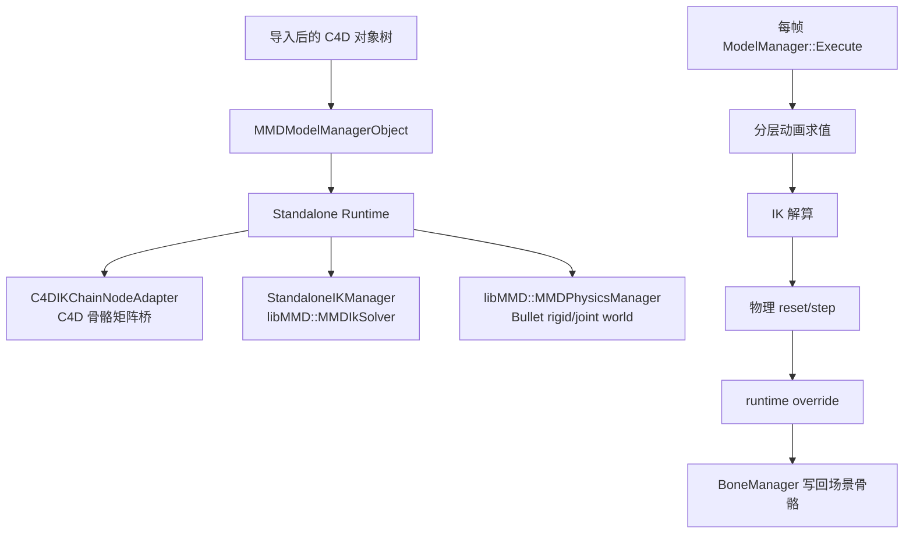
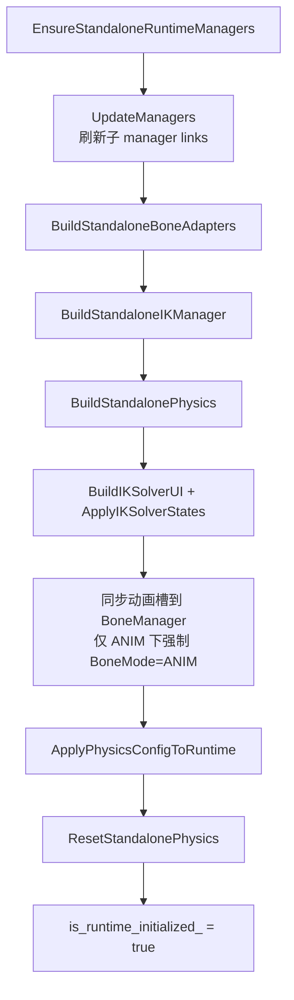
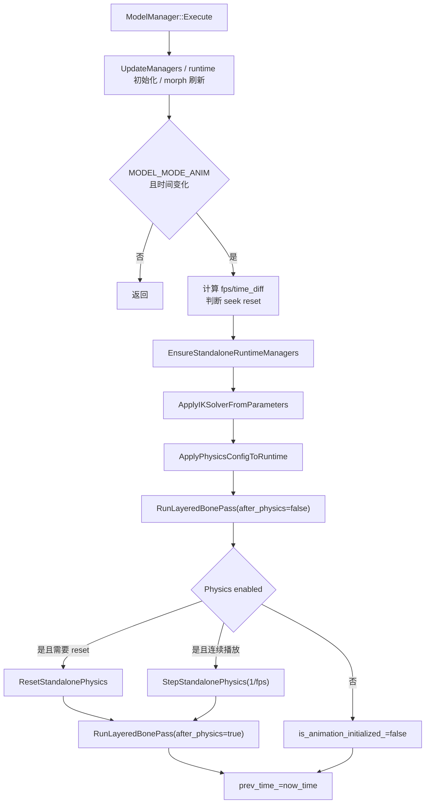
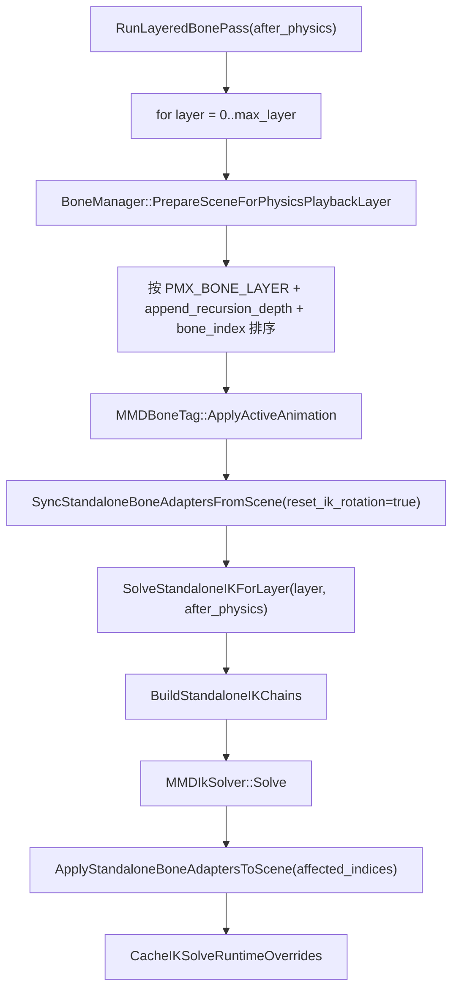
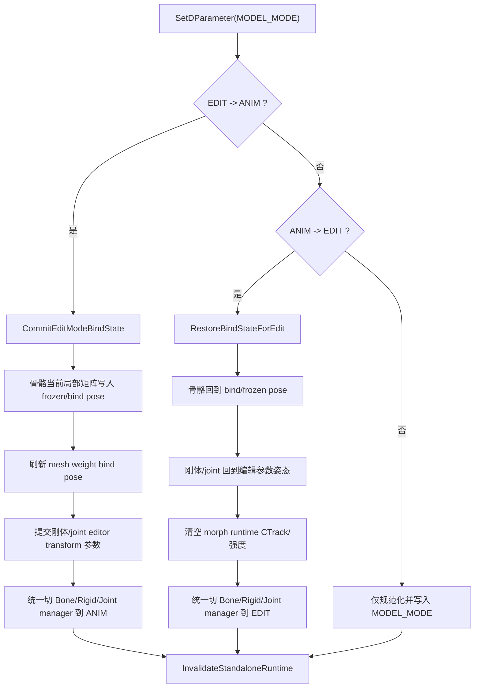

# 运行时流程

本文整理当前 ModelManager 主导的动画、IK、物理 runtime 流程。PMX/VMD 文件导入链路见
[`import-flow.md`](import-flow.md)。

## 关键代码地图

| 区域 | 主要职责 |
|---|---|
| `source/module/tools/object/mmd_model_manager.cpp` | 模型根对象：运行时主驱动、standalone IK/physics runtime、每帧分层执行 |
| `source/module/tools/object/mmd_bone_manager.cpp` | 骨骼 manager：分层准备动画、消费 runtime override、最终协调写回 |
| `source/module/tools/tag/mmd_bone.cpp` | 骨骼 tag：动画槽求值、append 继承、IK chain 构建、runtime override 缓存 |
| `source/module/tools/object/mmd_rigid_manager.cpp` | 从 C4D 刚体对象重建 runtime rigid bodies |
| `source/module/tools/object/mmd_joint_manager.cpp` | 从 C4D joint 对象重建 runtime constraints |
| `dependency/libMMD/src` | `MMDIkSolver`、`MMDPhysicsManager` 和 Bullet 封装 |
| `docs/dev/anim-flow-debug.md` | 动画/IK/物理诊断日志说明 |

## Ownership 边界

完整 PMX 模型里，`MMDBoneTag` 负责保存参数和求值单根骨骼动画状态；`MMDModelManagerObject`
负责运行时主驱动、IK/物理 runtime、以及何时把结果写回场景。没有 ModelManager 的单骨骼场景才会由
`MMDBoneTag::RunIKSolveAnimMode()` 自己解 IK。

## Standalone Runtime 重建

`EnsureStandaloneRuntimeManagers()` 是运行时重建总入口。它在 PMX 导入后、存档打开后、模式切换后、
动画槽切换后，或 runtime 被显式 invalidated 后触发。它只负责重建 standalone runtime 和刷新子 manager
链接，不再把各 manager 的编辑/动画模式常态回写成 ModelManager 模式；统一模式同步只发生在
ModelManager 自身切换 `MODEL_MODE` 的显式路径中。

### Bone adapters

`BuildStandaloneBoneAdapters()` 为每根骨骼创建一个 `C4DIKChainNodeAdapter`。adapter 是 C4D 骨骼矩阵和
`libMMD::IMMDNode` 之间的桥：

- `SetupFromBone()` 绑定 C4D bone object、`MMDBoneTag` 和骨骼名。
- 根据 C4D 父子层级连接 adapter parent/children。
- `UpdateInitialGlobalTransform()` 从 `GetFrozenMln()` 读取 bind/frozen pose。
- `ResetCurrentTransformToInitial()` 把 runtime current transform 回到初始姿态。

后续 IK 与物理都通过 adapter 读写骨骼局部/全局矩阵，最后由 `ApplyLocalToBoneObject()` 写回 C4D `RelMl`。

### IK runtime

`BuildStandaloneIKManager()` 遍历带 `PMX_BONE_IS_IK` 的骨骼，为每个 IK 骨骼创建 `libmmd::MMDIkSolver`：

- solver name 来自骨骼名。
- IK node 是控制/目标骨，也就是 PMX IK bone 自身。
- target node 是 effector，优先用 `PMX_BONE_IK_TARGET_BONE_LINK` 解析，旧场景才回退到 index。
- iteration count 至少为 4，避免过低 PMX 设置让 runtime 解算几乎失效。
- 启用状态来自 ModelManager 的 IK UI 状态，缺省回退到骨骼的 IK flag。

具体 chain links 不在这里一次性展开，而是在 `MMDBoneTag::BuildStandaloneIKChains()` 中按 tag 的动态
IK link 描述生成。chain link 也优先用稳定的 `BaseLink`，再回退旧 index。

### Physics runtime

`BuildStandalonePhysics()` 创建新的 `libmmd::MMDPhysicsManager`：

1. `MMDRigidManagerObject::BuildStandaloneRigidBodies()` 按刚体 index 排序，从 C4D 刚体对象参数重建
   `libmmd::PMXRigidbody`，并用 bone adapter 绑定对应骨骼。
2. 非 `Static` 且绑定骨骼有效的刚体骨骼会加入 `physics_dynamic_bone_indices_`。
3. `MMDJointManagerObject::BuildStandaloneJoints()` 按 joint index 排序，使用 runtime rigid body 创建约束。
4. runtime rigid bodies 和 joints 添加到 libMMD/Bullet physics world。
5. `ReconnectRigidBodyPointers()` / `ReconnectJointPointers()` 把 C4D 对象重新指向新 runtime 对象；存档重开后这一步尤其重要。

`ResetStandalonePhysics()` 会先禁用刚体、ResetTransform、跑一次短 physics update、ReflectGlobalTransform，
再把动态骨骼结果同步回 adapter 和 BoneManager override，最后 reset/activate rigid body。

## 每帧主流程

完整模型的每帧主驱动在 `MMDModelManagerObject::Execute()`：

几个运行时规则要一起看：

- VMD 骨骼动画求值用 `GetAnimationFrameFromDocumentContinuous(doc)`，也就是文档秒数乘 30fps VMD 帧。
- physics step 使用当前 C4D 文档 fps：`StepStandalonePhysics(1.f / fps_)`。
- seek、跳帧、回到最小时间或第一次播放会触发 `ResetStandalonePhysics()`，不是直接沿用上一帧物理状态。
- 物理关闭时仍会先执行 pre-physics 的 `RunLayeredBonePass(false)`，因此 IK 不依赖物理开启才运行。

## 分层动画与 IK

`RunLayeredBonePass(doc, after_physics)` 是动画、append、IK 的交错入口：

`MMDBoneTag::ApplyActiveAnimation()` 会按当前连续 VMD 帧在动画槽中插值，处理：

- 只有一帧、早于首帧、晚于末帧的 clamp。
- 两个 VMD key 之间的 `libmmd::InterpolateBoneKeys()`。
- `PMX_BONE_TRANSLATABLE` / `PMX_BONE_ROTATABLE` 限制。
- append translation / append rotation 继承。

完整模型中，`MMDBoneTag::Execute()` 看到 ModelManager 存在时只会 `ApplyActiveAnimation(op, doc, false)`，
也就是更新 tag 内部求值状态，不直接写场景。真正写场景发生在 ModelManager 的 layered pass、IK/physics
adapter 写回，以及 BoneManager 消费 runtime override 时。

## 物理 step 与 override

`StepStandalonePhysics(elapsed)` 的运行顺序是：

1. 每个 runtime rigid body `SyncBonePositionToPhysics(elapsed)`，把骨骼驱动的刚体同步到物理世界。
2. `physics->Update(elapsed)`。
3. 每个 rigid body `ReflectGlobalTransform()`，把物理结果反映回绑定 adapter。
4. `SyncStandaloneBoneAdaptersLocalFromGlobal(physics_dynamic_bone_indices_)`。
5. 对动态物理骨骼调用 `MMDBoneManagerObject::SetPhysicsOverride()`。
6. `ApplyPhysicsResultsToBoneObjects()` 写回动态骨骼并标记 mesh dirty。

IK 也会通过 `CacheIKSolveRuntimeOverrides()` 把受影响骨骼的 relative state 写入 BoneManager override。
这样后续 BoneManager pass 不会把刚刚由 IK/物理写回的骨骼又用普通动画覆盖掉。

## BoneManager 最终协调

`MMDBoneManagerObject::Execute()` 在 `MODEL_MODE_ANIM` 下遍历骨骼，主要消费两类 runtime override：

- 当前骨骼自己的 override：物理或 IK 已经算出最终 relative state。
- append source 的 override：继承源骨骼在同帧被 IK/物理更新后，依赖它的骨骼需要读取新状态。

当前代码里 `should_run_post_physics_ik` 固定为 `false`，post-physics 的分层动画/IK 入口由
`MMDModelManagerObject::RunLayeredBonePass(doc, true)` 负责，而不是 BoneManager 再独立跑第二套 IK。

## 模式切换边界

ModelManager 的 `MODEL_MODE` 是模型级状态边界；Bone/Rigid/Joint/Mesh manager 自身也有模式，允许单独切换
以便调试或局部编辑。`UpdateManagers()` 只刷新子 manager links 和跨 manager 引用，不承担模式同步职责。

模型级切换发生在 `MMDModelManagerObject::SetDParameter(MODEL_MODE)`：

### EDIT -> ANIM

`CommitEditModeBindState()` 把编辑模式中的当前调整提交成新的绑定状态：

- BoneManager 先刷新骨骼索引，再把每根骨骼当前 `GetMl()` 提交到 frozen transform，并重写
  `PMX_BONE_POSITION`。
- MeshManager 通过 `RefreshWeightBindPoses()` 刷新权重 tag 的 bind pose。
- RigidManager / JointManager 把编辑姿态写回 shape / attitude 参数，作为后续 runtime 重建输入。
- Bone/Rigid/Joint manager 被统一切到 ANIM；刚体和 joint 的 `NO_DD` 保持开启，编辑启用状态由各对象的
  mode 和 `GetDEnabling()` 控制。
- EDIT 下缓存的 morph slot 会重新生成 ANIM 使用的 ModelManager CTrack，然后清空 slot 缓存。

### ANIM -> EDIT

`RestoreBindStateForEdit()` 把模型从运行时状态恢复到可编辑绑定状态：

- BoneManager 使用 frozen/bind pose 恢复骨骼，并清除骨骼 morph、IK runtime override 和上一帧求值状态。
- RigidManager / JointManager 从各自持久化参数恢复 C4D 对象姿态。
- ModelManager 把当前 morph CTrack 缓存到 EDIT 专用 morph slot，再删除 morph CTrack 并把强度归零；动态
  morph UI 和 morph 定义保留，便于编辑模式继续新增、汇总和调试。
- Bone/Rigid/Joint manager 被统一切到 EDIT。之后用户仍可在各 manager 上单独切模式，ModelManager 不会在
  下一帧通过 `UpdateManagers()` 抢回状态。

### 存档打开与旧模式值

存档读取后，`Read()` 会规范化旧版 `*_MODE_VMD` 数值到 `*_MODE_ANIM`，保证老文件能打开。打开后的第一次
runtime 初始化只在模型处于 `MODEL_MODE_ANIM` 时把 BoneManager 强制切到 ANIM；如果存档处于 EDIT 或用户刚从
ANIM 切到 EDIT，runtime 重建不会再把骨骼重新锁回动画模式。

## 运行时失效点

会让 runtime 失效并等待下一帧重建的常见入口：

- PMX 重新导入：`MMDModelManagerObject::LoadPMX()`。
- VMD 动作导入或 merge：`LoadVMDMotion()` 末尾。
- ModelManager 的 `MODEL_MODE` 或 `MODEL_ANIM_LIST` 变化。
- `MSG_MENUPREPARE`，例如存档打开后重新准备对象。
- 物理相关参数变化会刷新 `prev_time_` / `is_animation_initialized_`，并重新应用 physics config。

运行时重建不是简单清空缓存：它还会重新从持久化对象参数恢复 IK links、刚体、关节、runtime 指针和
BoneManager 的动画槽状态。因此调试存档重开问题时，要同时检查骨骼、刚体和关节，而不是只看骨骼 tag。

## 运行时问题定位

| 症状 | 优先检查 |
|---|---|
| IK 看似解了但骨骼没动 | `ApplyStandaloneBoneAdaptersToScene()` 是否写回 affected indices；`CacheIKSolveRuntimeOverrides()` 是否防止后续覆盖 |
| 物理/IK 存档重开后丢失 | `EnsureStandaloneRuntimeManagers()` 是否重建 adapters/IK/physics；rigid/joint pointer 是否 reconnect |
| 连续播放和拖动时间轴表现不同 | `needs_physics_reset` 判断、`prev_time_`、`ResetStandalonePhysics()` 与 `StepStandalonePhysics()` 的分支 |
| append/inherit 骨骼顺序异常 | `PrepareSceneForPhysicsPlaybackLayer()` 的 `(PMX_BONE_LAYER, append_recursion_depth, bone_index)` 排序 |
| 物理结果被动画覆盖 | `MMDBoneManagerObject::SetPhysicsOverride()`、`GetPlaybackRuntimeOverride()` 和 BoneManager final pass |
| runtime 未按新设置生效 | 对应参数是否调用 `InvalidateStandaloneRuntime()` 或刷新 `prev_time_` / `is_animation_initialized_` |
| 模型切 EDIT 后骨骼仍像 ANIM 被锁住 | `RestoreBindStateForEdit()` 是否下发 manager EDIT；`EnsureStandaloneRuntimeManagers()` 是否只在 `MODEL_MODE_ANIM` 下强制 BoneMode |
| manager 单独切模式后又被改回 | 检查是否有常态 mode 回写；`UpdateManagers()` 不应同步 `BONE_MODE` / `RIGID_MODE` / `JOINT_MODE` / `MESH_MODE` |

配合运行时日志时，先看 `docs/dev/anim-flow-debug.md` 里的 `[CMT][AnimFlow]` 诊断。对 C4D 2026
现场调试，按 `AGENTS.md` 的 LLDB-DAP attach 流程：先正常启动 C4D 加载插件，再 attach 到进程。

本页使用 Mermaid 作为流程图格式，因为函数名、箭头和运行顺序需要可 diff、可维护、可审查。
