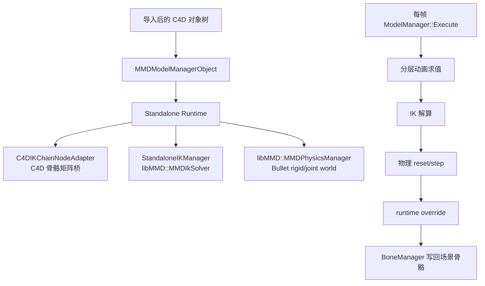
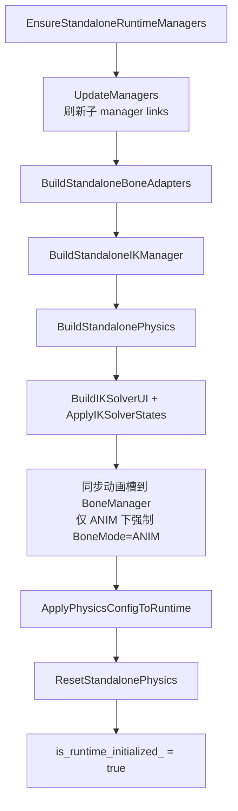
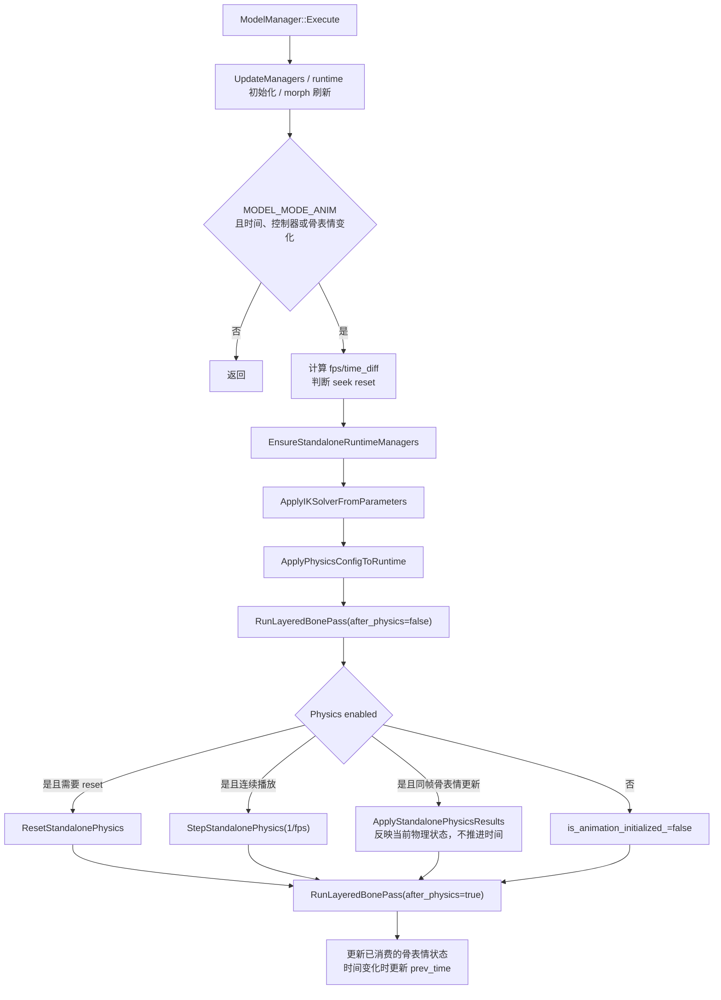
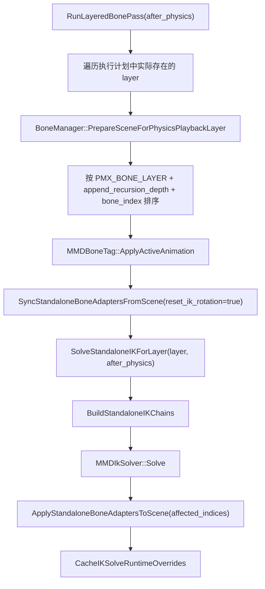
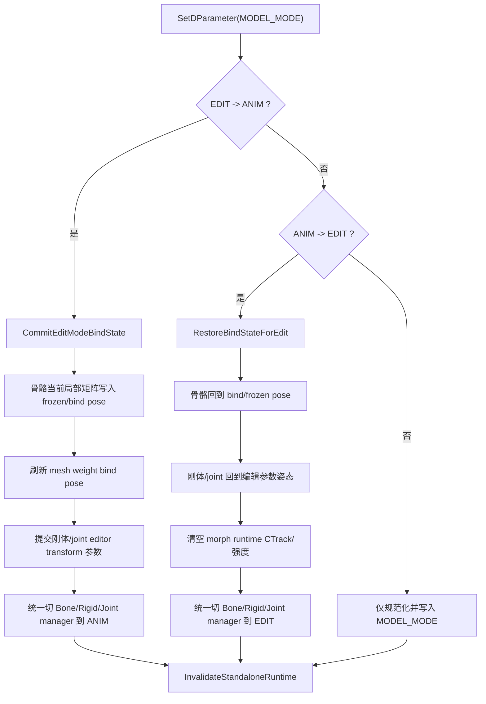

# 运行时流程

本文整理当前 ModelManager 主导的动画、IK、物理 runtime 流程。PMX/VMD 文件导入链路见
[`import-flow.md`](import-flow.md)。

## 关键代码地图

| 区域 | 主要职责 |
|---|---|
| `source/module/tools/object/mmd_model_manager.cpp` | 模型根对象：ObjectData 入口、持久化、动画槽、导入导出及属性 UI |
| `source/module/tools/object/mmd_model_runtime.cpp` | standalone IK/physics 重建、骨骼适配器和每帧分层执行 |
| `source/module/tools/object/mmd_model_morph_runtime.cpp` | group/flip 有效强度、材质表情合成及场景同步 |
| `source/module/tools/object/mmd_bone_manager.cpp` | 骨骼 manager：分层准备动画、消费 runtime override、最终协调写回 |
| `source/module/tools/tag/mmd_bone.cpp` | 骨骼 tag：动画槽求值、append 继承、IK chain 构建、runtime override 缓存 |
| `source/module/tools/object/mmd_rigid_manager.cpp` | 从 C4D 刚体对象重建 runtime rigid bodies |
| `source/module/tools/object/mmd_joint_manager.cpp` | 从 C4D joint 对象重建 runtime constraints |
| `dependency/libMMD/src` | `MMDIkSolver`、`MMDPhysicsManager` 和 Bullet 封装 |
| `source/utils/cmt_bone_execution_plan.hpp` | 与 SDK 无关的骨骼排序、实际 layer 分组和 IK 顺序缓存 |
| `source/utils/cmt_material_morph_accumulator.hpp` | 与 SDK 无关的材质 Mul/Add 字段计算 |
| `docs/dev/anim-flow-debug.md` | 动画/IK/物理诊断日志说明 |

## Ownership 边界

完整 PMX 模型里，`MMDBoneTag` 负责保存参数和求值单根骨骼动画状态；`MMDModelManagerObject`
负责运行时主驱动、IK/物理 runtime、以及何时把结果写回场景。没有 ModelManager 的单骨骼场景才会由
`MMDBoneTag::RunIKSolveAnimMode()` 自己解 IK。

```mermaid
flowchart TD
    A["导入后的 C4D 对象树"] --> B["MMDModelManagerObject"]
    B --> C["Standalone Runtime"]
    C --> D["C4DIKChainNodeAdapter<br/>C4D 骨骼矩阵桥"]
    C --> E["StandaloneIKManager<br/>libMMD::MMDIkSolver"]
    C --> F["libMMD::MMDPhysicsManager<br/>Bullet rigid/joint world"]

    G["每帧 ModelManager::Execute"] --> H["分层动画求值"]
    H --> I["IK 解算"]
    I --> J["物理 reset/step"]
    J --> K["runtime override"]
    K --> L["BoneManager 写回场景骨骼"]
```

## 原生 PSR 控制器接入

ANIM 模式支持用普通空对象，通过骨骼上的 C4D 原生 Constraint/约束标签的 PSR
位置、旋转通道驱动 PMX 骨骼。控制器放到骨架之外，初始世界矩阵对齐目标骨骼，
再设置 PSR 目标。控制腿部时，将约束加到 PMX 的足 IK 目标骨；直接约束上身或手臂
可使用旋转通道。无需删除 Protection 标签或改动 frozen 绑定矩阵。

约束优先级使用 **Expression/表达式 -499～499**，默认 0 即可。有效约束存在时：

1. ModelManager 在 Expression -500 准备本帧 MMD 动画、表情和继承基线。
2. C4D 原生约束求解目标混合、轴掩码、权重与偏移。
3. Expression +500 采样受驱动骨骼的相对局部矩阵，再执行 MMD 分层继承、IK 和物理。

只接管实际启用的位置/旋转通道，其余通道保留 MMD 动画。IK 目标约束参与链求解；
如果链内骨骼被明确旋转约束，则对应 MMD IK 链让出控制权。动态物理骨骼仍服从现有
物理写回规则。缩放、其他约束模式、其他优先级阶段及跨模型循环驱动不属于该接入范围。

输入缓存每次求值重新生成，不序列化、不跨文档复制。禁用、删除或丢失目标后，即使
没有切帧也会恢复 MMD 动画；同帧拖动重新解 IK，但不推进 Bullet 时间。没有有效约束
的模型仍在 Expression 0 求解。

原生回归入口为 `tests/runtime/native_external_psr_test.py::run`，在 C4D MCP 的
`exec_python` 中调用，传入已经通过生产导入器导入的文档、资源 ID 字典和输出目录。
默认骨骼名适配 `scripts/c4d_regression_fixtures.py` 生成的 `model.pmx`；真实模型可传入
`goal/effector/joint` 名称映射和位移量。测试在文档副本中覆盖 IK、同帧稳定性、优先级、
物理开关、禁用/删除/断链/撤销、保存重开及原生 Joint 对照，并输出 JSON 回执和场景。
小模型的 hinge 由物理驱动，因此默认仅验证关闭物理的 IK；阿芙等腿部由 IK 驱动的模型
传入 `physics_modes=(False, True)` 验证两种模式。`direction` 选择能改变链角度的移动方向。

## Standalone Runtime 重建

`EnsureStandaloneRuntimeManagers()` 是运行时重建总入口。它在 PMX 导入后、存档打开后、模式切换后、
动画槽切换后，或 runtime 被显式 invalidated 后触发。它只负责重建 standalone runtime 和刷新子 manager
链接，不再把各 manager 的编辑/动画模式常态回写成 ModelManager 模式；统一模式同步只发生在
ModelManager 自身切换 `MODEL_MODE` 的显式路径中。

```mermaid
flowchart TD
    A["EnsureStandaloneRuntimeManagers"] --> B["UpdateManagers<br/>刷新子 manager links"]
    B --> C["BuildStandaloneBoneAdapters"]
    C --> D["BuildStandaloneIKManager"]
    D --> E["BuildStandalonePhysics"]
    E --> F["BuildIKSolverUI + ApplyIKSolverStates"]
    F --> G["同步动画槽到 BoneManager<br/>仅 ANIM 下强制 BoneMode=ANIM"]
    G --> H["ApplyPhysicsConfigToRuntime"]
    H --> I["ResetStandalonePhysics"]
    I --> J["is_runtime_initialized_ = true"]
```

### Bone adapters

`BuildStandaloneBoneAdapters()` 为每根骨骼创建一个 `C4DIKChainNodeAdapter`。adapter 是 C4D 骨骼矩阵和
`libMMD::IMMDNode` 之间的桥：

- `SetupFromBone()` 绑定 C4D bone object、`MMDBoneTag` 和骨骼名。
- 根据 C4D 父子层级连接 adapter parent/children。
- `UpdateInitialGlobalTransform()` 从 `GetFrozenMln()` 读取 bind/frozen pose。
- `ResetCurrentTransformToInitial()` 把 runtime current transform 回到初始姿态。

后续 IK 与物理都通过 adapter 读写骨骼局部/全局矩阵，最后由 `ApplyLocalToBoneObject()` 写回 C4D `RelMl`。

### IK runtime

`BuildStandaloneIKManager()` 遍历带 `PMX_BONE_IS_IK` 的骨骼，为每个 IK 骨骼创建 `libmmd::MMDIkSolver`：

- solver name 来自骨骼名。
- IK node 是控制/目标骨，也就是 PMX IK bone 自身。
- target node 是 effector，优先用 `PMX_BONE_IK_TARGET_BONE_LINK` 解析，旧场景才回退到 index。
- iteration count 至少为 4，避免过低 PMX 设置让 runtime 解算几乎失效。
- 启用状态来自 ModelManager 的 IK UI 状态，缺省回退到骨骼的 IK flag。

具体 chain links 不在这里一次性展开，而是在 `MMDBoneTag::BuildStandaloneIKChains()` 中按 tag 的动态
IK link 描述生成。chain link 也优先用稳定的 `BaseLink`，再回退旧 index。

### Physics runtime

`BuildStandalonePhysics()` 创建新的 `libmmd::MMDPhysicsManager`：

1. `MMDRigidManagerObject::BuildStandaloneRigidBodies()` 按刚体 index 排序，从 C4D 刚体对象参数重建
   `libmmd::PMXRigidbody`，并用 bone adapter 绑定对应骨骼。
2. 非 `Static` 且绑定骨骼有效的刚体骨骼会加入 `physics_dynamic_bone_indices_`。
3. `MMDJointManagerObject::BuildStandaloneJoints()` 按 joint index 排序，使用 runtime rigid body 创建约束。
4. runtime rigid bodies 和 joints 添加到 libMMD/Bullet physics world。
5. `ReconnectRigidBodyPointers()` / `ReconnectJointPointers()` 把 C4D 对象重新指向新 runtime 对象；存档重开后这一步尤其重要。

`ResetStandalonePhysics()` 在已初始化的 runtime 中先把 adapter 的 current transform 临时恢复到缓存的
initial/bind transform，再重建完整 Bullet world、刚体和关节；这使关节 anchor 按 bind-space body 构造。
随后从当前场景恢复 adapter 的动画姿态，并重新应用物理配置。首次初始化的 world 本来就是新建的，
因此不重复重建。两条路径最后都执行刚体 `ResetTransform()`、清理 contact pair 算法及速度/力，并激活刚体。
reset 本身不执行 physics update、Reflect 或场景骨骼写回，也不提交新的 bind；正常帧的更新和写回由
`StepStandalonePhysics()` / `ApplyStandalonePhysicsResults()` 负责。

## 每帧主流程

完整模型的每帧主驱动在 `MMDModelManagerObject::Execute()`：

```mermaid
flowchart TD
    A["ModelManager::Execute"] --> B["UpdateManagers / runtime 初始化 / morph 刷新"]
    B --> C{"MODEL_MODE_ANIM<br/>且时间、控制器或骨表情变化"}
    C -- 否 --> Z["返回"]
    C -- 是 --> D["计算 fps/time_diff<br/>判断 seek reset"]
    D --> E["EnsureStandaloneRuntimeManagers"]
    E --> F["ApplyIKSolverFromParameters"]
    F --> G["ApplyPhysicsConfigToRuntime"]
    G --> H["RunLayeredBonePass(after_physics=false)"]
    H --> I{"Physics enabled"}
    I -- 是且需要 reset --> J["ResetStandalonePhysics"]
    I -- 是且连续播放 --> K["StepStandalonePhysics(1/fps)"]
    I -- 是且同帧骨表情更新 --> O["ApplyStandalonePhysicsResults<br/>反映当前物理状态，不推进时间"]
    J --> L["RunLayeredBonePass(after_physics=true)"]
    K --> L
    O --> L
    I -- 否 --> M["is_animation_initialized_=false"]
    L --> N["更新已消费的骨表情状态<br/>时间变化时更新 prev_time"]
    M --> L
```

几个运行时规则要一起看：

- VMD 骨骼动画求值用 `GetAnimationFrameFromDocumentContinuous(doc)`，也就是文档秒数乘 30fps VMD 帧。
- physics step 使用当前 C4D 文档 fps：`StepStandalonePhysics(1.f / fps_)`。
- seek、跳帧、回到最小时间或第一次播放会触发 `ResetStandalonePhysics()`，不是直接沿用上一帧物理状态。
- 物理关闭时仍会先执行 pre-physics 的 `RunLayeredBonePass(false)`，因此 IK 不依赖物理开启才运行。
- 固定帧调节骨表情时，检查展开后的 tag 强度和骨表情平移/旋转定义，重新执行 pre/post 骨阶段。
  同帧清理旧 IK/append override，同时保留显式 transient VPD 姿态；已经初始化的物理世界只重新反映
  当前状态，不额外调用 Bullet update、reset 或提交 bind。复制/重建清除骨表情状态的消费缓存。

## 分层动画与 IK

`RunLayeredBonePass(doc, after_physics)` 是动画、append、IK 的交错入口：

```mermaid
flowchart TD
    A["RunLayeredBonePass(after_physics)"] --> B["遍历执行计划中实际存在的 layer"]
    B --> C["BoneManager::PrepareSceneForPhysicsPlaybackLayer"]
    C --> D["按 PMX_BONE_LAYER + append_recursion_depth + bone_index 排序"]
    D --> E["MMDBoneTag::ApplyActiveAnimation"]
    E --> F["SyncStandaloneBoneAdaptersFromScene(reset_ik_rotation=true)"]
    F --> G["SolveStandaloneIKForLayer(layer, after_physics)"]
    G --> H["BuildStandaloneIKChains"]
    H --> I["MMDIkSolver::Solve"]
    I --> J["ApplyStandaloneBoneAdaptersToScene(affected_indices)"]
    J --> K["CacheIKSolveRuntimeOverrides"]
```

`MMDBoneTag::ApplyActiveAnimation()` 会按当前连续 VMD 帧在动画槽中插值，处理：

- 只有一帧、早于首帧、晚于末帧的 clamp。
- 两个 VMD key 之间的 `libmmd::InterpolateBoneKeys()`。
- `PMX_BONE_TRANSLATABLE` / `PMX_BONE_ROTATABLE` 限制。
- append translation / append rotation 继承。

完整模型中，`MMDBoneTag::Execute()` 看到 ModelManager 存在时只会 `ApplyActiveAnimation(op, doc, false)`，
也就是更新 tag 内部求值状态，不直接写场景。真正写场景发生在 ModelManager 的 layered pass、IK/physics
adapter 写回，以及 BoneManager 消费 runtime override 时。

BoneManager 在每次播放 pass 前通过 `EnsurePlaybackExecutionPlan()` 比较排序/分组参数快照。
层级或 append 通知会显式使计划失效，直接写入 BaseContainer 的 layer、pre/post phase、IK flag、append
源与继承标志也会被下一次快照比较检测到。仅发生变化时重新计算顺序；实际存在的 layer 单独存储，避免
稀疏大 layer 值造成空层遍历。动画顺序保持 `(layer, append_depth, bone_index)`，IK 同层顺序保持 PMX index。
单独调用 `PrepareSceneForPhysicsPlaybackLayer()` 的代码应先刷新计划，不能绕过一次 pass 的快照入口。

## 物理 step 与 override

`StepStandalonePhysics(elapsed)` 的运行顺序是：

1. 每个 runtime rigid body `SyncBonePositionToPhysics(elapsed)`，把骨骼驱动的刚体同步到物理世界。
2. `physics->Update(elapsed)`。
3. 每个 rigid body `ReflectGlobalTransform()`，把物理结果反映回绑定 adapter。
4. `SyncStandaloneBoneAdaptersLocalFromGlobal(physics_dynamic_bone_indices_)`。
5. 对动态物理骨骼调用 `MMDBoneManagerObject::SetPhysicsOverride()`。
6. `ApplyPhysicsResultsToBoneObjects()` 写回动态骨骼并标记 mesh dirty。

IK 也会通过 `CacheIKSolveRuntimeOverrides()` 把受影响骨骼的 relative state 写入 BoneManager override。
这样后续 BoneManager pass 不会把刚刚由 IK/物理写回的骨骼又用普通动画覆盖掉。

## BoneManager 最终协调

`MMDBoneManagerObject::Execute()` 在 `MODEL_MODE_ANIM` 下遍历骨骼，主要消费两类 runtime override：

- 当前骨骼自己的 override：物理或 IK 已经算出最终 relative state。
- append source 的 override：继承源骨骼在同帧被 IK/物理更新后，依赖它的骨骼需要读取新状态。

当前代码里 `should_run_post_physics_ik` 固定为 `false`，post-physics 的分层动画/IK 入口由
`MMDModelManagerObject::RunLayeredBonePass(doc, true)` 负责，而不是 BoneManager 再独立跑第二套 IK。

## 模式切换边界

ModelManager 的 `MODEL_MODE` 是模型级状态边界；Bone/Rigid/Joint/Mesh manager 自身也有模式，允许单独切换
以便调试或局部编辑。`UpdateManagers()` 只刷新子 manager links 和跨 manager 引用，不承担模式同步职责。

模型级切换发生在 `MMDModelManagerObject::SetDParameter(MODEL_MODE)`：

```mermaid
flowchart TD
    A["SetDParameter(MODEL_MODE)"] --> B{"EDIT -> ANIM ?"}
    B -- 是 --> C["CommitEditModeBindState"]
    C --> D["骨骼当前局部矩阵写入 frozen/bind pose"]
    D --> E["刷新 mesh weight bind pose"]
    E --> F["提交刚体/joint editor transform 参数"]
    F --> G["统一切 Bone/Rigid/Joint manager 到 ANIM"]
    B -- 否 --> H{"ANIM -> EDIT ?"}
    H -- 是 --> I["RestoreBindStateForEdit"]
    I --> J["骨骼回到 bind/frozen pose"]
    J --> K["刚体/joint 回到编辑参数姿态"]
    K --> L["清空 morph runtime CTrack/强度"]
    L --> M["统一切 Bone/Rigid/Joint manager 到 EDIT"]
    H -- 否 --> N["仅规范化并写入 MODEL_MODE"]
    G --> O["InvalidateStandaloneRuntime"]
    M --> O
    N --> O
```

### EDIT -> ANIM

`CommitEditModeBindState()` 把编辑模式中的当前调整提交成新的绑定状态：

- BoneManager 先刷新骨骼索引，再把每根骨骼当前 `GetMl()` 提交到 frozen transform，并重写
  `PMX_BONE_POSITION`。
- MeshManager 通过 `RefreshWeightBindPoses()` 刷新权重 tag 的 bind pose。
- RigidManager / JointManager 把编辑姿态写回 shape / attitude 参数，作为后续 runtime 重建输入。
- Bone/Rigid/Joint manager 被统一切到 ANIM；刚体和 joint 的 `NO_DD` 保持开启，编辑启用状态由各对象的
  mode 和 `GetDEnabling()` 控制。
- EDIT 下缓存的 morph slot 会重新生成 ANIM 使用的 ModelManager CTrack，然后清空 slot 缓存。

### ANIM -> EDIT

`RestoreBindStateForEdit()` 把模型从运行时状态恢复到可编辑绑定状态：

- BoneManager 使用 frozen/bind pose 恢复骨骼，并清除骨骼 morph、IK runtime override 和上一帧求值状态。
- RigidManager / JointManager 从各自持久化参数恢复 C4D 对象姿态。
- ModelManager 把当前 morph CTrack 缓存到 EDIT 专用 morph slot，再删除 morph CTrack 并把强度归零；动态
  morph UI 和 morph 定义保留，便于编辑模式继续新增、汇总和调试。
- Bone/Rigid/Joint manager 被统一切到 EDIT。之后用户仍可在各 manager 上单独切模式，ModelManager 不会在
  下一帧通过 `UpdateManagers()` 抢回状态。

### 存档打开与旧模式值

存档读取后，`Read()` 会规范化旧版 `*_MODE_VMD` 数值到 `*_MODE_ANIM`，保证老文件能打开。打开后的第一次
runtime 初始化只在模型处于 `MODEL_MODE_ANIM` 时把 BoneManager 强制切到 ANIM；如果存档处于 EDIT 或用户刚从
ANIM 切到 EDIT，runtime 重建不会再把骨骼重新锁回动画模式。

## 运行时失效点

会让 runtime 失效并等待下一帧重建的常见入口：

- PMX 重新导入：`MMDModelManagerObject::LoadPMX()`。
- VMD 动作导入或 merge：`LoadVMDMotion()` 末尾。
- ModelManager 的 `MODEL_MODE` 或 `MODEL_ANIM_LIST` 变化。
- `MSG_MENUPREPARE`，例如存档打开后重新准备对象。
- 物理相关参数变化会刷新 `prev_time_` / `is_animation_initialized_`，并重新应用 physics config。

运行时重建不是简单清空缓存：它还会重新从持久化对象参数恢复 IK links、刚体、关节、runtime 指针和
BoneManager 的动画槽状态。因此调试存档重开问题时，要同时检查骨骼、刚体和关节，而不是只看骨骼 tag。

## 运行时问题定位

### 模型级控制器外观

模型属性的“控制器”页统一提供创建/刷新、选中可见控制器、显示范围、控制器尺寸和穿透显示。
“主要控制器”过滤 PMX 标为隐藏或不可操作的骨骼，以及名称明确标记为辅助、扭转或眼镜附件的控制器
（如 `+左ひじ補助`、`左腕捩`、`elbow_helper_L`、`arm twist_L`）。这些对象仍会生成并保留，
“全部控制器”可显示和选择它们；隐藏仅影响
视口，不停用控制器的动画输入。创建/刷新会切换到仅显示控制器的骨骼显示模式。

参考 C4D Character 的用途分工：左侧亮蓝、右侧红、中间黄色。关节旋转使用圆环，手腕使用浅立体框，
固定轴使用错开的菱形，位移使用圆角框。圆环方向三角片放在局部 +X 边缘外，间距为半径的 12%；
三角片平面垂直于圆环平面，底边沿边缘切线方向展开，宽 0.70 半径、轴向高 0.55 半径。
标准根、中心/沟槽/腰、上下半身、颈、头骨也生成控制器；中央控制器按用途分开：根为大圆环、中心为大圆角框、沟槽为椭圆、腰为三角、下半身为下指三角、上半身/颈/头为圆环，均无附加鳍片，
无 PMX 显式轴时沿模型水平面放置。仅完整标准名称匹配，饰品和辅助链不按中央名称前缀生成。
脚 IK、脚尖 IK、IK 父框和固定轴菱形保留纯平面轮廓，不附加鳍片；脚 IK 宽度为原来的 80%，
IK 父框横纵比为 1:2，减少左右脚的重叠。主轮廓和鳍片分别显式闭合，避免原生样条多出斜边。
尺寸按 bind 骨架跨度、用途和层级计算：
肩、臂、肘、腕的基础半径比例为 0.90、0.85、0.70、0.60；辅助使用 0.22 的小菱形，扭转使用
0.32 并保留固定轴形状。整体倍率为 25%–300%，不会随动画姿势变化。
穿透显示默认开启：XRAY pass 中绘制连续彩色轮廓及细深色描边，选中后加粗提亮；关闭后使用原生
样条的遮挡关系。真实 spline 几何仍用于选取，叠加轮廓不加入渲染网格。

外观刷新只更新插件管理的样条点与颜色，保留相对输入、冻结变换、链接、关键帧和绑定姿态。
仅新建控制器初始化冻结坐标；外部艺术家链接的对象不重设形状。BoneManager 缓存已应用的外观设置，
属性撤销/重做或容器直接修改后重新同步，避免只恢复面板数值。骨骼管理器的既有显示模式会同步模型面板。

### 腿脚、FK 与 IK 控制器

创建/刷新同时覆盖 PMX 标为 IK 的目标，以及完整匹配标准日文/英文名称的腿、膝、脚踝、脚尖、足先 EX
和 IK 父级。D 后缀变形副骨不按名字重复生成；带局部轴/固定轴的既有控制器继续保留。不会根据名字新建 IK 链。
大腿、膝盖和脚踝使用逐级缩小的圆环，足 IK 为脚形框、脚尖 IK 为小三角、IK 父级为大圆角框。
没有显式 PMX 局部轴/固定轴时，IK 控制器沿模型水平面放置；这些轴标记仍优先。

拖动足 IK、脚尖 IK 或其父级，会沿原始 MMD IK 链求解。转动链上的 FK 圆环时，该链让出旋转控制权；
未登记的 FK 输入归零后恢复原有 IK。模型/骨骼的登记关键帧操作会把 FK 旋转写成现有的 authored-pose
关键帧，防止清零控制器后被 IK 覆盖；已登记姿势仍可继续叠加控制器调整。普通 IK 目标关键帧仍作为解算输入。
这些 authored-pose 标记保存在 C4D 动画槽中，不属于 VMD 格式；向其他软件输出最终动作需要使用烘焙导出。

同帧修改控制器会清除上一轮 IK/append 缓存，但不推进 Bullet。控制器增量换算使用父级当前变换、骨骼冻结坐标
和本帧基础动画旋转，避免把上一轮已解算的姿势反馈为下一轮输入。注册操作不会为持久化 FK 关键帧额外保留
会吸收后续控制器调整的 transient pose。

`tests/runtime/native_leg_control_test.py` 使用真实模型，覆盖双腿的 FK/IK 驱动、归零、反复同帧求值、
刷新、C4D 控制器轨道、MMD FK 关键帧登记、继续编辑、保存重开及绑定状态保持；可指定动作帧和物理开关。

原生回归入口为 `tests/runtime/native_control_presentation_test.py`。它克隆已导入的模型，检查显示范围、
原生选择按钮、尺寸、绑定/姿势/关键帧保留、撤销/重做、保存重开以及外部链接保护；穿透显示还需要
同视角真实视口的开/关截图验收。

### 动画与物理排查

| 症状 | 优先检查 |
|---|---|
| IK 看似解了但骨骼没动 | `ApplyStandaloneBoneAdaptersToScene()` 是否写回 affected indices；`CacheIKSolveRuntimeOverrides()` 是否防止后续覆盖 |
| 物理/IK 存档重开后丢失 | `EnsureStandaloneRuntimeManagers()` 是否重建 adapters/IK/physics；rigid/joint pointer 是否 reconnect |
| 连续播放和拖动时间轴表现不同 | `needs_physics_reset` 判断、`prev_time_`、`ResetStandalonePhysics()` 与 `StepStandalonePhysics()` 的分支 |
| append/inherit 骨骼顺序异常 | `PrepareSceneForPhysicsPlaybackLayer()` 的 `(PMX_BONE_LAYER, append_recursion_depth, bone_index)` 排序 |
| 物理结果被动画覆盖 | `MMDBoneManagerObject::SetPhysicsOverride()`、`GetPlaybackRuntimeOverride()` 和 BoneManager final pass |
| runtime 未按新设置生效 | 对应参数是否调用 `InvalidateStandaloneRuntime()` 或刷新 `prev_time_` / `is_animation_initialized_` |
| 模型切 EDIT 后骨骼仍像 ANIM 被锁住 | `RestoreBindStateForEdit()` 是否下发 manager EDIT；`EnsureStandaloneRuntimeManagers()` 是否只在 `MODEL_MODE_ANIM` 下强制 BoneMode |
| manager 单独切模式后又被改回 | 检查是否有常态 mode 回写；`UpdateManagers()` 不应同步 `BONE_MODE` / `RIGID_MODE` / `JOINT_MODE` / `MESH_MODE` |

配合运行时日志时，先看 `docs/dev/anim-flow-debug.md` 里的 `[CMT][AnimFlow]` 诊断。对 C4D 2026
现场调试，按 `AGENTS.md` 的 LLDB-DAP attach 流程：先正常启动 C4D 加载插件，再 attach 到进程。

本页使用 Mermaid 作为流程图格式，因为函数名、箭头和运行顺序需要可 diff、可维护、可审查。

## 阶段耗时与回归

设置 `CMT_RUNTIME_PROFILE=1` 后，ModelManager 输出 `[CMT][RuntimeProfile]`，包含 `frame`、`rebuildMs`、
`animationMs`、`ikMs`、`physicsMs`、`morphMs`、`materialMs` 和累计 `planRebuilds`。
关闭时不读取时钟；嵌套文档求值使用独立统计并恢复外层上下文。统计覆盖当前线程调用栈中的阶段，
`morphMs` 包含其材质同步子阶段，数值不能简单相加，也不能作为跨线程整帧总耗时。

算法、输入 fixture 和回执检查通过后，还需要按 [regression.md](regression.md) 在真实 C4D 中执行
场景保存重开、模式/层级/动画槽/物理和材质回归；编译和纯逻辑测试不能替代原生场景验收。

肩部方框按模型方向向上、向外移开，并用引线连接原枢轴。眼部椭圆朝向模型正面；
共有眼控以实际左右眼中点定位显示，避免 MMD 头顶的“両目”枢轴把轮廓带到头顶。
布局转换使用冻结控制坐标，不随相对姿势反向抵消，刷新和缩放保持动画输入。
